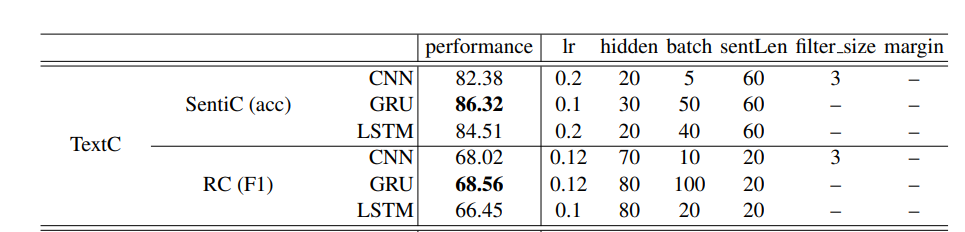

# Building Sentiment Analysis models

Last updated : October 21th, 2022 

# Introduction

During this project, I will create an optimized Sentiment Analysis model based on a dataset created from Twitter reviews. This project will be completely created in Microsoft Azure Machine Learning Studio, and I will compare our model with the Microsoft Azure cognitive API service for Sentiment Analysis.

## 1. Data Preprocessing

We will first load and process our dataset.

### 1.1 Loading packages and the Dataset


```python
#Importing packages
import matplotlib.pyplot as plt
import numpy as np
import pandas as pd
import seaborn as sns
#Setting large figure size for Seaborn
sns.set(rc={'figure.figsize':(11.7,8.27),"font.size":20,"axes.titlesize":20,"axes.labelsize":18})
import dill

import os
import shutil

import tensorflow as tf
import tensorflow_hub as hub
import tensorflow_text as text
import tensorflow_datasets as tfds
from official.nlp import optimization  # to create AdamW optimizer

tf.get_logger().setLevel('ERROR')
```

    2022-10-19 17:20:42.666292: I tensorflow/core/platform/cpu_feature_guard.cc:193] This TensorFlow binary is optimized with oneAPI Deep Neural Network Library (oneDNN) to use the following CPU instructions in performance-critical operations:  AVX2 AVX512F FMA
    To enable them in other operations, rebuild TensorFlow with the appropriate compiler flags.
    2022-10-19 17:20:45.424199: E tensorflow/stream_executor/cuda/cuda_blas.cc:2981] Unable to register cuBLAS factory: Attempting to register factory for plugin cuBLAS when one has already been registered
    2022-10-19 17:20:49.870165: W tensorflow/stream_executor/platform/default/dso_loader.cc:64] Could not load dynamic library 'libnvinfer.so.7'; dlerror: libnvinfer.so.7: cannot open shared object file: No such file or directory
    2022-10-19 17:20:49.870326: W tensorflow/stream_executor/platform/default/dso_loader.cc:64] Could not load dynamic library 'libnvinfer_plugin.so.7'; dlerror: libnvinfer_plugin.so.7: cannot open shared object file: No such file or directory
    2022-10-19 17:20:49.870337: W tensorflow/compiler/tf2tensorrt/utils/py_utils.cc:38] TF-TRT Warning: Cannot dlopen some TensorRT libraries. If you would like to use Nvidia GPU with TensorRT, please make sure the missing libraries mentioned above are installed properly.


```python
# azureml-core of version 1.0.72 or higher is required
from azureml.core import Workspace, Dataset
import cred

subscription_id = cred.subscription_id
resource_group = cred.resource_group
workspace_name = cred.workspace_name

workspace = Workspace(subscription_id, resource_group, workspace_name)

dataset = Dataset.get_by_name(workspace, name='sentiment')
dataset.download(target_path='.', overwrite=False)

df = pd.read_csv('/mnt/batch/tasks/shared/LS_root/mounts/clusters/fatskill1/code/Users/fatskill/sentiment.csv', encoding='latin-1', header=None,
    names = ['label', 'id', 'date', 'query', 'user' , 'text'])

df.head()
```


<div>
<style scoped>
    .dataframe tbody tr th:only-of-type {
        vertical-align: middle;
    }

    .dataframe tbody tr th {
        vertical-align: top;
    }

    .dataframe thead th {
        text-align: right;
    }
</style>
<table border="1" class="dataframe">
  <thead>
    <tr style="text-align: right;">
      <th></th>
      <th>target</th>
      <th>id</th>
      <th>date</th>
      <th>query</th>
      <th>user</th>
      <th>text</th>
    </tr>
  </thead>
  <tbody>
    <tr>
      <th>0</th>
      <td>0</td>
      <td>1467810369</td>
      <td>Mon Apr 06 22:19:45 PDT 2009</td>
      <td>NO_QUERY</td>
      <td>_TheSpecialOne_</td>
      <td>@switchfoot http://twitpic.com/2y1zl - Awww, t...</td>
    </tr>
    <tr>
      <th>1</th>
      <td>0</td>
      <td>1467810672</td>
      <td>Mon Apr 06 22:19:49 PDT 2009</td>
      <td>NO_QUERY</td>
      <td>scotthamilton</td>
      <td>is upset that he can't update his Facebook by ...</td>
    </tr>
    <tr>
      <th>2</th>
      <td>0</td>
      <td>1467810917</td>
      <td>Mon Apr 06 22:19:53 PDT 2009</td>
      <td>NO_QUERY</td>
      <td>mattycus</td>
      <td>@Kenichan I dived many times for the ball. Man...</td>
    </tr>
    <tr>
      <th>3</th>
      <td>0</td>
      <td>1467811184</td>
      <td>Mon Apr 06 22:19:57 PDT 2009</td>
      <td>NO_QUERY</td>
      <td>ElleCTF</td>
      <td>my whole body feels itchy and like its on fire</td>
    </tr>
    <tr>
      <th>4</th>
      <td>0</td>
      <td>1467811193</td>
      <td>Mon Apr 06 22:19:57 PDT 2009</td>
      <td>NO_QUERY</td>
      <td>Karoli</td>
      <td>@nationwideclass no, it's not behaving at all....</td>
    </tr>
  </tbody>
</table>
</div>


### 1.2 Data Cleaning and EDA

Several columns seem unrelevant in this dataset. First of all, let's check unique values of the **QUERY** column.


```python
df['query'].unique()

df.drop(columns="query", inplace=True)

df.info()
df.head()
```

    <class 'pandas.core.frame.DataFrame'>
    RangeIndex: 1600000 entries, 0 to 1599999
    Data columns (total 5 columns):
     #   Column  Non-Null Count    Dtype 
    ---  ------  --------------    ----- 
     0   target  1600000 non-null  int64 
     1   id      1600000 non-null  int64 
     2   date    1600000 non-null  object
     3   user    1600000 non-null  object
     4   text    1600000 non-null  object
    dtypes: int64(2), object(3)
    memory usage: 61.0+ MB


<div>
<style scoped>
    .dataframe tbody tr th:only-of-type {
        vertical-align: middle;
    }

    .dataframe tbody tr th {
        vertical-align: top;
    }

    .dataframe thead th {
        text-align: right;
    }
</style>
<table border="1" class="dataframe">
  <thead>
    <tr style="text-align: right;">
      <th></th>
      <th>target</th>
      <th>id</th>
      <th>date</th>
      <th>user</th>
      <th>text</th>
    </tr>
  </thead>
  <tbody>
    <tr>
      <th>0</th>
      <td>0</td>
      <td>1467810369</td>
      <td>Mon Apr 06 22:19:45 PDT 2009</td>
      <td>_TheSpecialOne_</td>
      <td>@switchfoot http://twitpic.com/2y1zl - Awww, t...</td>
    </tr>
    <tr>
      <th>1</th>
      <td>0</td>
      <td>1467810672</td>
      <td>Mon Apr 06 22:19:49 PDT 2009</td>
      <td>scotthamilton</td>
      <td>is upset that he can't update his Facebook by ...</td>
    </tr>
    <tr>
      <th>2</th>
      <td>0</td>
      <td>1467810917</td>
      <td>Mon Apr 06 22:19:53 PDT 2009</td>
      <td>mattycus</td>
      <td>@Kenichan I dived many times for the ball. Man...</td>
    </tr>
    <tr>
      <th>3</th>
      <td>0</td>
      <td>1467811184</td>
      <td>Mon Apr 06 22:19:57 PDT 2009</td>
      <td>ElleCTF</td>
      <td>my whole body feels itchy and like its on fire</td>
    </tr>
    <tr>
      <th>4</th>
      <td>0</td>
      <td>1467811193</td>
      <td>Mon Apr 06 22:19:57 PDT 2009</td>
      <td>Karoli</td>
      <td>@nationwideclass no, it's not behaving at all....</td>
    </tr>
  </tbody>
</table>
</div>


The QUERY column only contains "NO_QUERY", so we can just **delete it from our dataset.**

Now we can also **turn our date column into a datetime field.**


```python
df["date"] = pd.to_datetime(df["date"], infer_datetime_format=True)

df.head()
```

    /home/faskill/miniconda3/envs/pro7/lib/python3.9/site-packages/dateutil/parser/_parser.py:1207: UnknownTimezoneWarning: tzname PDT identified but not understood.  Pass `tzinfos` argument in order to correctly return a timezone-aware datetime.  In a future version, this will raise an exception.
      warnings.warn("tzname {tzname} identified but not understood.  "


<div>
<style scoped>
    .dataframe tbody tr th:only-of-type {
        vertical-align: middle;
    }

    .dataframe tbody tr th {
        vertical-align: top;
    }

    .dataframe thead th {
        text-align: right;
    }
</style>
<table border="1" class="dataframe">
  <thead>
    <tr style="text-align: right;">
      <th></th>
      <th>target</th>
      <th>id</th>
      <th>date</th>
      <th>user</th>
      <th>text</th>
    </tr>
  </thead>
  <tbody>
    <tr>
      <th>0</th>
      <td>0</td>
      <td>1467810369</td>
      <td>2009-04-06 22:19:45</td>
      <td>_TheSpecialOne_</td>
      <td>@switchfoot http://twitpic.com/2y1zl - Awww, t...</td>
    </tr>
    <tr>
      <th>1</th>
      <td>0</td>
      <td>1467810672</td>
      <td>2009-04-06 22:19:49</td>
      <td>scotthamilton</td>
      <td>is upset that he can't update his Facebook by ...</td>
    </tr>
    <tr>
      <th>2</th>
      <td>0</td>
      <td>1467810917</td>
      <td>2009-04-06 22:19:53</td>
      <td>mattycus</td>
      <td>@Kenichan I dived many times for the ball. Man...</td>
    </tr>
    <tr>
      <th>3</th>
      <td>0</td>
      <td>1467811184</td>
      <td>2009-04-06 22:19:57</td>
      <td>ElleCTF</td>
      <td>my whole body feels itchy and like its on fire</td>
    </tr>
    <tr>
      <th>4</th>
      <td>0</td>
      <td>1467811193</td>
      <td>2009-04-06 22:19:57</td>
      <td>Karoli</td>
      <td>@nationwideclass no, it's not behaving at all....</td>
    </tr>
  </tbody>
</table>
</div>


The **user and date fields** are not relevant to our sentiment analysis so we can remove them from our database.


```python

df = df[["label","text"]]

df.head()
```


<div>
<style scoped>
    .dataframe tbody tr th:only-of-type {
        vertical-align: middle;
    }

    .dataframe tbody tr th {
        vertical-align: top;
    }

    .dataframe thead th {
        text-align: right;
    }
</style>
<table border="1" class="dataframe">
  <thead>
    <tr style="text-align: right;">
      <th></th>
      <th>target</th>
      <th>text</th>
    </tr>
  </thead>
  <tbody>
    <tr>
      <th>0</th>
      <td>0</td>
      <td>@switchfoot http://twitpic.com/2y1zl - Awww, t...</td>
    </tr>
    <tr>
      <th>1</th>
      <td>0</td>
      <td>is upset that he can't update his Facebook by ...</td>
    </tr>
    <tr>
      <th>2</th>
      <td>0</td>
      <td>@Kenichan I dived many times for the ball. Man...</td>
    </tr>
    <tr>
      <th>3</th>
      <td>0</td>
      <td>my whole body feels itchy and like its on fire</td>
    </tr>
    <tr>
      <th>4</th>
      <td>0</td>
      <td>@nationwideclass no, it's not behaving at all....</td>
    </tr>
  </tbody>
</table>
</div>


Now let's loot at the **repartition of labels** in our dataset :


```python
print(df.label.unique())
plt.hist(df.label)
plt.show()

#Since labels are only 0 or 4, we will convert them to 0 and 1
df.loc[df.label == 4, "label"] = 1

df.label.unique()
```

    [0 4]


    

    


    array([0, 1])


We can see that the **labels are perfectly balanced** with **800k samples** for both categories. We will not have to perform resampling of our dataset.

Now we will just quickly calculate the polarity of our text using the **VaderSentimentAnalysis** tool:


```python
from vaderSentiment.vaderSentiment import SentimentIntensityAnalyzer
analyzer = SentimentIntensityAnalyzer()

def analyze_polarity(x):
    sentences = str(x).split('.')
    scores = []
    for s in sentences:
        scores.append(analyzer.polarity_scores(s)["compound"])
    return np.mean(scores) 

df["polarity"] = df["text"].apply(analyze_polarity)
```


```python
plt.hist(df[df.label==0]["polarity"])
plt.title("Histogram of the polarity of tweets with label = 0")
plt.xlabel("Polarity (VaderSentiment)")
plt.ylabel("Number of tweets")
plt.show()
print("Average polarity (VaderSentiment) of tweets with label 0 : {}".format(df[df.label==0]["polarity"].mean()))

plt.hist(df[df.label==1]["polarity"])
plt.title("Histogram of the polarity of tweets with label = 1")
plt.xlabel("Polarity (VaderSentiment)")
plt.ylabel("Number of tweets")
plt.show()
print("Average polarity (VaderSentiment) of tweets with label 1 : {}".format(df[df.label==1]["polarity"].mean()))
```


    

    


    Average polarity (VaderSentiment) of tweets with label 0 : -0.032109591417991246


    

    


    Average polarity (VaderSentiment) of tweets with label 1 : 0.23552064498962427


We can see that texts with a label of 0 have a **low polarity** while texts with a label of 1 have a rather **high polarity** which validates our dataset labels. 

Now we can start preprocessing our text data.

### 1.3 Text Data Preprocessing

In this part, we will use Spacy to **lemmatize our Twitter posts**.

Spacy will also **remove stopwords and punctuations** from our posts.


```python
import spacy
import spacy_transformers
from tqdm.auto import tqdm
tqdm.pandas()

nlp = spacy.load("en_core_web_sm")

def lemmatize(x):
    doc = nlp(x)
    tokens = [token.lemma_ for token in doc if not (token.is_stop or token.is_punct)]
    return ' '.join(tokens)

df["lemma_text"] = df["text"].progress_apply(lemmatize)

df.head()
```


      0%|          | 0/1600000 [00:00<?, ?it/s]


<div>
<style scoped>
    .dataframe tbody tr th:only-of-type {
        vertical-align: middle;
    }

    .dataframe tbody tr th {
        vertical-align: top;
    }

    .dataframe thead th {
        text-align: right;
    }
</style>
<table border="1" class="dataframe">
  <thead>
    <tr style="text-align: right;">
      <th></th>
      <th>label</th>
      <th>text</th>
      <th>polarity</th>
      <th>lemma_text</th>
    </tr>
  </thead>
  <tbody>
    <tr>
      <th>0</th>
      <td>0</td>
      <td>@switchfoot http://twitpic.com/2y1zl - Awww, t...</td>
      <td>-0.044875</td>
      <td>@switchfoot http://twitpic.com/2y1zl Awww bumm...</td>
    </tr>
    <tr>
      <th>1</th>
      <td>0</td>
      <td>is upset that he can't update his Facebook by ...</td>
      <td>-0.206880</td>
      <td>upset update Facebook texte cry result   Schoo...</td>
    </tr>
    <tr>
      <th>2</th>
      <td>0</td>
      <td>@Kenichan I dived many times for the ball. Man...</td>
      <td>0.246950</td>
      <td>@Kenichan dive time ball manage save 50   rest...</td>
    </tr>
    <tr>
      <th>3</th>
      <td>0</td>
      <td>my whole body feels itchy and like its on fire</td>
      <td>-0.250000</td>
      <td>body feel itchy like fire</td>
    </tr>
    <tr>
      <th>4</th>
      <td>0</td>
      <td>@nationwideclass no, it's not behaving at all....</td>
      <td>-0.123475</td>
      <td>@nationwideclass behave mad</td>
    </tr>
  </tbody>
</table>
</div>


```python
with open("df.pkl", "wb") as file:
    dill.dump(df, file)
```


```python
with open("df.pkl", "rb") as file:
    df = dill.load(file)
df.head()
```


<div>
<style scoped>
    .dataframe tbody tr th:only-of-type {
        vertical-align: middle;
    }

    .dataframe tbody tr th {
        vertical-align: top;
    }

    .dataframe thead th {
        text-align: right;
    }
</style>
<table border="1" class="dataframe">
  <thead>
    <tr style="text-align: right;">
      <th></th>
      <th>label</th>
      <th>text</th>
      <th>polarity</th>
      <th>lemma_text</th>
    </tr>
  </thead>
  <tbody>
    <tr>
      <th>0</th>
      <td>0</td>
      <td>@switchfoot http://twitpic.com/2y1zl - Awww, t...</td>
      <td>-0.044875</td>
      <td>@switchfoot http://twitpic.com/2y1zl Awww bumm...</td>
    </tr>
    <tr>
      <th>1</th>
      <td>0</td>
      <td>is upset that he can't update his Facebook by ...</td>
      <td>-0.206880</td>
      <td>upset update Facebook texte cry result   Schoo...</td>
    </tr>
    <tr>
      <th>2</th>
      <td>0</td>
      <td>@Kenichan I dived many times for the ball. Man...</td>
      <td>0.246950</td>
      <td>@Kenichan dive time ball manage save 50   rest...</td>
    </tr>
    <tr>
      <th>3</th>
      <td>0</td>
      <td>my whole body feels itchy and like its on fire</td>
      <td>-0.250000</td>
      <td>body feel itchy like fire</td>
    </tr>
    <tr>
      <th>4</th>
      <td>0</td>
      <td>@nationwideclass no, it's not behaving at all....</td>
      <td>-0.123475</td>
      <td>@nationwideclass behave mad</td>
    </tr>
  </tbody>
</table>
</div>


### 1.4 Creating a Tensorflow dataframe

Now that we have preprocessed the text data, we will load it into a **Tensorflow dataframe**.

We will also perform a **test/train/validation split** to be able to evaluate our model without introducing data leakage. 


```python
from sklearn.model_selection import train_test_split
TEST_SIZE = 0.1

train, test = train_test_split(df, test_size=TEST_SIZE)
train, val = train_test_split(train, test_size =TEST_SIZE/(1-TEST_SIZE))

X_train, X_test, X_val = train["lemma_text"], test["lemma_text"], val["lemma_text"]
y_train, y_test, y_val = train["label"], test["label"], val["label"]

train_ds = tf.data.Dataset.from_tensor_slices((X_train,y_train))
test_ds = tf.data.Dataset.from_tensor_slices((X_test,y_test))
val_ds = tf.data.Dataset.from_tensor_slices((X_val,y_val))

next(iter(train_ds))
```

    2022-10-19 17:21:03.297349: E tensorflow/stream_executor/cuda/cuda_driver.cc:265] failed call to cuInit: CUDA_ERROR_NO_DEVICE: no CUDA-capable device is detected
    2022-10-19 17:21:03.297418: I tensorflow/stream_executor/cuda/cuda_diagnostics.cc:156] kernel driver does not appear to be running on this host (fatskill1): /proc/driver/nvidia/version does not exist
    2022-10-19 17:21:03.317631: I tensorflow/core/platform/cpu_feature_guard.cc:193] This TensorFlow binary is optimized with oneAPI Deep Neural Network Library (oneDNN) to use the following CPU instructions in performance-critical operations:  AVX2 AVX512F FMA
    To enable them in other operations, rebuild TensorFlow with the appropriate compiler flags.


    (<tf.Tensor: shape=(), dtype=string, numpy=b'dinner Palace fam   fb'>,
     <tf.Tensor: shape=(), dtype=int64, numpy=1>)


We will also configure our dataframe for performance by **caching it, shuffling it and creating batches.**

This will significantly speed up the model training process.


```python
AUTOTUNE = tf.data.AUTOTUNE
BATCH_SIZE = 50

def configure_for_performance(ds):
    ds = ds.cache()
    ds = ds.shuffle(buffer_size=1000)
    ds = ds.batch(BATCH_SIZE)
    #ds = ds.prefetch(buffer_size=AUTOTUNE)
    return ds

train_ds = configure_for_performance(train_ds)
test_ds = configure_for_performance(test_ds)
val_ds = configure_for_performance(val_ds)
```

### 1.5 Text Data Embedding

Our text data is not ready for analyzing, we need to turn our text data into vectors. 

In this part we will use the **TextVectorization kera layer** with a vocabulary size of 10k words.

Later on in this project, we will use the more performant **BERT embedding**.


```python
#Basic text encoder using TextVectorization
VOCAB_SIZE = 10000
encoder = tf.keras.layers.TextVectorization(
    max_tokens=VOCAB_SIZE)
encoder.adapt(train_ds.map(lambda text, label: text))
```

Let's look at the most frequent words of our vocabulary :


```python
vocab = np.array(encoder.get_vocabulary())
vocab[:20]
```


    array(['', '[UNK]', 'go', 'good', 'day', 'work', 'get', 'like', 'love',
           'today', 'time', 'think', 'not', 'know', 'lol', 'want', 'miss',
           'thank', 'u', 'm'], dtype='<U27')


These words are not very interesting but we get expected results. 

Now we can look at the **encoding of a random Twitter post** :


```python
encoded_example = encoder(example)[:3].numpy()
encoded_example
```


    array([[1610,    6,  470, 4950,   78, 8008,  105,  381,    0,    0,    0,
               0,    0,    0,    0,    0,    0,    0,    0,    0],
           [   1,  798,  175,  500,   31,  372, 1205,   42,   96,    0,    0,
               0,    0,    0,    0,    0,    0,    0,    0,    0],
           [ 294,    1,   23,  365,  209,  564,  469, 9127,    0,    0,    0,
               0,    0,    0,    0,    0,    0,    0,    0,    0]])


As we can see, our documents have been turned into **multidimensional vectors**.

Now we can look into how our posts have been transformed within the encoder's vocabulary :


```python
for n in range(3):
  print("Original: ", example[n].numpy())
  print("Round-trip: ", " ".join(vocab[encoded_example[n]]))
  print()
```

    Original:  b'success get dress department eat brekkie early hungry'
    Round-trip:  success get dress department eat brekkie early hungry            
    
    Original:  b'@ishamay ohh post hmm   hope June 16   sad girl :|'
    Round-trip:  [UNK] ohh post hmm hope june 16 sad girl           
    
    Original:  b'Awww @chriscuzzy need vote fall blue line   http://bit.ly/pmvry'
    Round-trip:  awww [UNK] need vote fall blue line httpbitlypmvry            
    


As we can see, even with the vocabulary size of 10k words, **some expressions have not been assigned to words** like random twitter handles.

Now that we finished encoding our text data, we are ready to start building a model.

## 2. Model Building

### 2.1 Simple Vectorization + RNN (LSTM)

We have chosen to use a Recurrent Neural Network (RNN) for this task after analyzing several Research Papers, and especially the [Comparative Study of CNN and RNN for Natural Language Processing, by Wenpeng Yin, Katharina Kann, Mo Yu and Hinrich Schütze](https://arxiv.org/abs/1702.01923v1)

The summary of their findings are presented below :



As is obvious, for Sentiment Analysis (SentiC), **RNN are more performant than CNNs**.

We will first use a **Long Short-Term Memory (LSTM) layer** instead of a GRU layer for ease of use.

Let's define our model :


```python
model = tf.keras.Sequential([
    encoder,
    tf.keras.layers.Embedding(
        input_dim=len(encoder.get_vocabulary()),
        output_dim=64,
        # Use masking to handle the variable sequence lengths
        mask_zero=True),
    tf.keras.layers.Bidirectional(tf.keras.layers.LSTM(64)),
    tf.keras.layers.Dense(64, activation='relu'),
    tf.keras.layers.Dense(1)
])

model.summary()
```

    Model: "sequential"
    _________________________________________________________________
     Layer (type)                Output Shape              Param #   
    =================================================================
     text_vectorization (TextVec  (None, None)             0         
     torization)                                                     
                                                                     
     embedding (Embedding)       (None, None, 64)          640000    
                                                                     
     bidirectional (Bidirectiona  (None, 128)              66048     
     l)                                                              
                                                                     
     dense (Dense)               (None, 64)                8256      
                                                                     
     dense_1 (Dense)             (None, 1)                 65        
                                                                     
    =================================================================
    Total params: 714,369
    Trainable params: 714,369
    Non-trainable params: 0
    _________________________________________________________________


Now we can import a sample text data and verify that our untrained model will provide us with the same result with 2 different inputs :


```python
sample_text = ('The movie was cool. The animation and the graphics '
               'were out of this world. I would recommend this movie.')
predictions = model.predict(np.array([sample_text]))
print(predictions[0])
```

    1/1 [==============================] - 1s 1s/step
    [-0.00789264]


```python
padding = "the " * 2000
predictions = model.predict(np.array([sample_text, padding]))
print(predictions[0])
```

    1/1 [==============================] - 0s 260ms/step
    [-0.00789263]


We can now **compile our model** :


```python
model.compile(loss=tf.keras.losses.BinaryCrossentropy(from_logits=True),
              optimizer=tf.keras.optimizers.Adam(1e-4),
              metrics=['accuracy'])
```

We use the **Adam optimizer and accuracy as our scoring metric** (this will automatically be transformed into Binary Accuracy by Keras since this is a Binary Classification probelm).

We implement **2 callbacks for our model** :

- A callback that will create a checkpoint if the validation accuracy exceeds the previous one
- A custom callback to clear the RAM which **prevents memory leakage during training**.


```python
checkpoint_filepath = 'tmp/checkpoint'
model_checkpoint_callback = tf.keras.callbacks.ModelCheckpoint(
    filepath=checkpoint_filepath,
    save_weights_only=True,
    monitor='val_accuracy',
    mode='max',
    save_best_only=True)

import gc
#Defining custom Call Back to prevent memory leak
class MemClearCallback(tf.keras.callbacks.Callback):
    def on_epoch_end(self, epoch, logs=None):
        gc.enable()
        tf.keras.backend.clear_session() #Resets RAM usage after every EPOCH
        gc.collect()
        
mem_clear = MemClearCallback()

```


```python
history = model.fit(train_ds,
                    epochs=50,
                    validation_data=val_ds,
                    validation_steps=30,
                    callbacks=[mem_clear, model_checkpoint_callback])
```

    Epoch 1/50
    25600/25600 [==============================] - 390s 15ms/step - loss: 0.4855 - accuracy: 0.7492 - val_loss: 0.4779 - val_accuracy: 0.7533
    Epoch 2/50
    24082/25600 [===========================>..] - ETA: 22s - loss: 0.4646 - accuracy: 0.7645

The model is fitted on **50 epochs** (NB: Jupyter output has not been displayed since the browser reloaded during training).


```python
model.evaluate(test_ds)
```

    3200/3200 [==============================] - 14s 4ms/step - loss: 1.2470 - accuracy: 0.7252


    [1.247040867805481, 0.7251999974250793]


After 50 epochs, we get an **accuracy of 0.725 on our validation set**.

Let's now plot our results :


```python
def plot_graphs(history, metric):
  plt.plot(history.history[metric])
  plt.plot(history.history['val_'+metric], '')
  plt.xlabel("Epochs")
  plt.ylabel(metric)
  plt.legend([metric, 'val_'+metric])

plt.figure(figsize=(16, 8))
plt.subplot(1, 2, 1)
plot_graphs(history, 'accuracy')
plt.ylim(None, 1)
plt.subplot(1, 2, 2)
plot_graphs(history, 'loss')
plt.ylim(0, None)
```


    (0.0, 1.3623144596815109)


    

    


We can see that after about 10 epochs, our **model started overfitting** as is shown by the increase in (train) accuracy and the decrease in validation accuracy. 

The **best model** is the one trained on the 5th epoch. But let's try to **improve our model layers** before reaching conclusions.

We will now use 2 LSTM layers and a dropout layer to try to decrease overfitting and increase model performance.

### 2.2 Simple Vectorization + 2*LSTM 

Let's define our second version of the model :


```python
#Adding Dropout layer to avoid overfitting and second LSTM layer

model_2 = tf.keras.Sequential([
    encoder,
    tf.keras.layers.Embedding(
        input_dim=len(encoder.get_vocabulary()),
        output_dim=64,
        # Use masking to handle the variable sequence lengths
        mask_zero=True),
    tf.keras.layers.Bidirectional(tf.keras.layers.LSTM(64,  return_sequences=True)),
    tf.keras.layers.Bidirectional(tf.keras.layers.LSTM(32)),
    tf.keras.layers.Dense(32, activation='relu'),
    tf.keras.layers.Dropout(0.3),
    tf.keras.layers.Dense(1)
])

model_2.summary()
```

    Model: "sequential_1"
    _________________________________________________________________
     Layer (type)                Output Shape              Param #   
    =================================================================
     text_vectorization (TextVec  (None, None)             0         
     torization)                                                     
                                                                     
     embedding_1 (Embedding)     (None, None, 64)          640000    
                                                                     
     bidirectional_2 (Bidirectio  (None, None, 128)        66048     
     nal)                                                            
                                                                     
     bidirectional_3 (Bidirectio  (None, 64)               41216     
     nal)                                                            
                                                                     
     dense_2 (Dense)             (None, 64)                4160      
                                                                     
     dropout_1 (Dropout)         (None, 64)                0         
                                                                     
     dense_3 (Dense)             (None, 1)                 65        
                                                                     
    =================================================================
    Total params: 751,489
    Trainable params: 751,489
    Non-trainable params: 0
    _________________________________________________________________


```python
model_2.compile(loss=tf.keras.losses.BinaryCrossentropy(from_logits=True),
              optimizer=tf.keras.optimizers.Adam(1e-4),
              metrics=['accuracy'])
```


```python
checkpoint_filepath = "tmp_2/cp-{epoch:04d}.ckpt"
model_checkpoint_callback = tf.keras.callbacks.ModelCheckpoint(
    filepath=checkpoint_filepath,
    save_weights_only=True,
    verbose=1)

import gc
#Defining custom Call Back to prevent memory leak
class MemClearCallback(tf.keras.callbacks.Callback):
    def on_epoch_end(self, epoch, logs=None):
        gc.enable()
        tf.keras.backend.clear_session() #Resets RAM usage after every EPOCH
        gc.collect()
        
mem_clear = MemClearCallback()


history_2 = model_2.fit(train_ds,
                    epochs=50,
                    validation_data=val_ds,
                    validation_steps=30,
                    callbacks=[mem_clear, model_checkpoint_callback])
```

    Epoch 1/50
    25599/25600 [============================>.] - ETA: 0s - loss: 0.4890 - accuracy: 0.7475
    Epoch 1: saving model to tmp_2/cp-0001.ckpt
    25600/25600 [==============================] - 698s 27ms/step - loss: 0.4890 - accuracy: 0.7475 - val_loss: 0.4639 - val_accuracy: 0.7660
    Epoch 2/50
    25599/25600 [============================>.] - ETA: 0s - loss: 0.4679 - accuracy: 0.7625
    Epoch 2: saving model to tmp_2/cp-0002.ckpt
    25600/25600 [==============================] - 696s 27ms/step - loss: 0.4679 - accuracy: 0.7625 - val_loss: 0.4586 - val_accuracy: 0.7553
    Epoch 3/50
    25599/25600 [============================>.] - ETA: 0s - loss: 0.4598 - accuracy: 0.7670
    Epoch 3: saving model to tmp_2/cp-0003.ckpt
    25600/25600 [==============================] - 700s 27ms/step - loss: 0.4598 - accuracy: 0.7670 - val_loss: 0.4563 - val_accuracy: 0.7620
    Epoch 4/50
    25599/25600 [============================>.] - ETA: 0s - loss: 0.4536 - accuracy: 0.7709
    Epoch 4: saving model to tmp_2/cp-0004.ckpt
    25600/25600 [==============================] - 704s 27ms/step - loss: 0.4536 - accuracy: 0.7709 - val_loss: 0.4387 - val_accuracy: 0.7740
    Epoch 5/50
    25600/25600 [==============================] - ETA: 0s - loss: 0.4476 - accuracy: 0.7746
    Epoch 5: saving model to tmp_2/cp-0005.ckpt
    25600/25600 [==============================] - 703s 27ms/step - loss: 0.4476 - accuracy: 0.7746 - val_loss: 0.4581 - val_accuracy: 0.7693
    Epoch 6/50
    25599/25600 [============================>.] - ETA: 0s - loss: 0.4422 - accuracy: 0.7782
    Epoch 6: saving model to tmp_2/cp-0006.ckpt
    25600/25600 [==============================] - 705s 27ms/step - loss: 0.4422 - accuracy: 0.7782 - val_loss: 0.4562 - val_accuracy: 0.7693
    Epoch 7/50
    25599/25600 [============================>.] - ETA: 0s - loss: 0.4371 - accuracy: 0.7815
    Epoch 7: saving model to tmp_2/cp-0007.ckpt
    25600/25600 [==============================] - 704s 27ms/step - loss: 0.4371 - accuracy: 0.7815 - val_loss: 0.4389 - val_accuracy: 0.7773
    Epoch 8/50
    25600/25600 [==============================] - ETA: 0s - loss: 0.4320 - accuracy: 0.7845
    Epoch 8: saving model to tmp_2/cp-0008.ckpt
    25600/25600 [==============================] - 686s 27ms/step - loss: 0.4320 - accuracy: 0.7845 - val_loss: 0.4538 - val_accuracy: 0.7780
    Epoch 9/50
    25600/25600 [==============================] - ETA: 0s - loss: 0.4271 - accuracy: 0.7880
    Epoch 9: saving model to tmp_2/cp-0009.ckpt
    25600/25600 [==============================] - 692s 27ms/step - loss: 0.4271 - accuracy: 0.7880 - val_loss: 0.4605 - val_accuracy: 0.7733
    Epoch 10/50
    25599/25600 [============================>.] - ETA: 0s - loss: 0.4223 - accuracy: 0.7910
    Epoch 10: saving model to tmp_2/cp-0010.ckpt
    25600/25600 [==============================] - 693s 27ms/step - loss: 0.4223 - accuracy: 0.7910 - val_loss: 0.4731 - val_accuracy: 0.7707
    Epoch 11/50
    25600/25600 [==============================] - ETA: 0s - loss: 0.4173 - accuracy: 0.7942
    Epoch 11: saving model to tmp_2/cp-0011.ckpt
    25600/25600 [==============================] - 691s 27ms/step - loss: 0.4173 - accuracy: 0.7942 - val_loss: 0.4749 - val_accuracy: 0.7707
    Epoch 12/50
    25600/25600 [==============================] - ETA: 0s - loss: 0.4124 - accuracy: 0.7976
    Epoch 12: saving model to tmp_2/cp-0012.ckpt
    25600/25600 [==============================] - 695s 27ms/step - loss: 0.4124 - accuracy: 0.7976 - val_loss: 0.4709 - val_accuracy: 0.7727
    Epoch 13/50
    25599/25600 [============================>.] - ETA: 0s - loss: 0.4074 - accuracy: 0.8006
    Epoch 13: saving model to tmp_2/cp-0013.ckpt
    25600/25600 [==============================] - 688s 27ms/step - loss: 0.4074 - accuracy: 0.8006 - val_loss: 0.4645 - val_accuracy: 0.7740
    Epoch 14/50
    25600/25600 [==============================] - ETA: 0s - loss: 0.4024 - accuracy: 0.8038
    Epoch 14: saving model to tmp_2/cp-0014.ckpt
    25600/25600 [==============================] - 696s 27ms/step - loss: 0.4024 - accuracy: 0.8038 - val_loss: 0.4765 - val_accuracy: 0.7727
    Epoch 15/50
    25600/25600 [==============================] - ETA: 0s - loss: 0.3975 - accuracy: 0.8064
    Epoch 15: saving model to tmp_2/cp-0015.ckpt
    25600/25600 [==============================] - 697s 27ms/step - loss: 0.3975 - accuracy: 0.8064 - val_loss: 0.4790 - val_accuracy: 0.7767
    Epoch 16/50
    25600/25600 [==============================] - ETA: 0s - loss: 0.3925 - accuracy: 0.8092
    Epoch 16: saving model to tmp_2/cp-0016.ckpt
    25600/25600 [==============================] - 697s 27ms/step - loss: 0.3925 - accuracy: 0.8092 - val_loss: 0.4860 - val_accuracy: 0.7667
    Epoch 17/50
    25600/25600 [==============================] - ETA: 0s - loss: 0.3874 - accuracy: 0.8122
    Epoch 17: saving model to tmp_2/cp-0017.ckpt
    25600/25600 [==============================] - 694s 27ms/step - loss: 0.3874 - accuracy: 0.8122 - val_loss: 0.5032 - val_accuracy: 0.7680
    Epoch 18/50
    25598/25600 [============================>.] - ETA: 0s - loss: 0.3825 - accuracy: 0.8150
    Epoch 18: saving model to tmp_2/cp-0018.ckpt
    25600/25600 [==============================] - 686s 27ms/step - loss: 0.3825 - accuracy: 0.8150 - val_loss: 0.4980 - val_accuracy: 0.7633
    Epoch 19/50
    25599/25600 [============================>.] - ETA: 0s - loss: 0.3774 - accuracy: 0.8176
    Epoch 19: saving model to tmp_2/cp-0019.ckpt
    25600/25600 [==============================] - 683s 27ms/step - loss: 0.3774 - accuracy: 0.8176 - val_loss: 0.5402 - val_accuracy: 0.7653
    Epoch 20/50
    25600/25600 [==============================] - ETA: 0s - loss: 0.3725 - accuracy: 0.8200
    Epoch 20: saving model to tmp_2/cp-0020.ckpt
    25600/25600 [==============================] - 677s 26ms/step - loss: 0.3725 - accuracy: 0.8200 - val_loss: 0.5444 - val_accuracy: 0.7613
    Epoch 21/50
    25600/25600 [==============================] - ETA: 0s - loss: 0.3675 - accuracy: 0.8227
    Epoch 21: saving model to tmp_2/cp-0021.ckpt
    25600/25600 [==============================] - 637s 25ms/step - loss: 0.3675 - accuracy: 0.8227 - val_loss: 0.5455 - val_accuracy: 0.7700
    Epoch 22/50
    25600/25600 [==============================] - ETA: 0s - loss: 0.3628 - accuracy: 0.8249
    Epoch 22: saving model to tmp_2/cp-0022.ckpt
    25600/25600 [==============================] - 632s 25ms/step - loss: 0.3628 - accuracy: 0.8249 - val_loss: 0.5557 - val_accuracy: 0.7600
    Epoch 23/50
    25599/25600 [============================>.] - ETA: 0s - loss: 0.3583 - accuracy: 0.8270
    Epoch 23: saving model to tmp_2/cp-0023.ckpt
    25600/25600 [==============================] - 640s 25ms/step - loss: 0.3583 - accuracy: 0.8270 - val_loss: 0.5743 - val_accuracy: 0.7627
    Epoch 24/50
    25598/25600 [============================>.] - ETA: 0s - loss: 0.3538 - accuracy: 0.8291
    Epoch 24: saving model to tmp_2/cp-0024.ckpt
    25600/25600 [==============================] - 646s 25ms/step - loss: 0.3538 - accuracy: 0.8291 - val_loss: 0.5793 - val_accuracy: 0.7560
    Epoch 25/50
    25600/25600 [==============================] - ETA: 0s - loss: 0.3493 - accuracy: 0.8310
    Epoch 25: saving model to tmp_2/cp-0025.ckpt
    25600/25600 [==============================] - 643s 25ms/step - loss: 0.3493 - accuracy: 0.8310 - val_loss: 0.5665 - val_accuracy: 0.7587
    Epoch 26/50
    25600/25600 [==============================] - ETA: 0s - loss: 0.3453 - accuracy: 0.8330
    Epoch 26: saving model to tmp_2/cp-0026.ckpt
    25600/25600 [==============================] - 644s 25ms/step - loss: 0.3453 - accuracy: 0.8330 - val_loss: 0.6139 - val_accuracy: 0.7493
    Epoch 27/50
    25600/25600 [==============================] - ETA: 0s - loss: 0.3410 - accuracy: 0.8348
    Epoch 27: saving model to tmp_2/cp-0027.ckpt
    25600/25600 [==============================] - 645s 25ms/step - loss: 0.3410 - accuracy: 0.8348 - val_loss: 0.5921 - val_accuracy: 0.7560
    Epoch 28/50
    25600/25600 [==============================] - ETA: 0s - loss: 0.3371 - accuracy: 0.8366
    Epoch 28: saving model to tmp_2/cp-0028.ckpt
    25600/25600 [==============================] - 647s 25ms/step - loss: 0.3371 - accuracy: 0.8366 - val_loss: 0.6799 - val_accuracy: 0.7513
    Epoch 29/50
    25599/25600 [============================>.] - ETA: 0s - loss: 0.3332 - accuracy: 0.8383
    Epoch 29: saving model to tmp_2/cp-0029.ckpt
    25600/25600 [==============================] - 642s 25ms/step - loss: 0.3332 - accuracy: 0.8383 - val_loss: 0.6626 - val_accuracy: 0.7580
    Epoch 30/50
    25599/25600 [============================>.] - ETA: 0s - loss: 0.3296 - accuracy: 0.8396
    Epoch 30: saving model to tmp_2/cp-0030.ckpt
    25600/25600 [==============================] - 639s 25ms/step - loss: 0.3296 - accuracy: 0.8396 - val_loss: 0.6499 - val_accuracy: 0.7587
    Epoch 31/50
    25599/25600 [============================>.] - ETA: 0s - loss: 0.3259 - accuracy: 0.8412
    Epoch 31: saving model to tmp_2/cp-0031.ckpt
    25600/25600 [==============================] - 651s 25ms/step - loss: 0.3259 - accuracy: 0.8412 - val_loss: 0.6737 - val_accuracy: 0.7647
    Epoch 32/50
    25598/25600 [============================>.] - ETA: 0s - loss: 0.3223 - accuracy: 0.8427
    Epoch 32: saving model to tmp_2/cp-0032.ckpt
    25600/25600 [==============================] - 651s 25ms/step - loss: 0.3223 - accuracy: 0.8427 - val_loss: 0.7163 - val_accuracy: 0.7467
    Epoch 33/50
    25599/25600 [============================>.] - ETA: 0s - loss: 0.3192 - accuracy: 0.8439
    Epoch 33: saving model to tmp_2/cp-0033.ckpt
    25600/25600 [==============================] - 644s 25ms/step - loss: 0.3192 - accuracy: 0.8439 - val_loss: 0.7505 - val_accuracy: 0.7500
    Epoch 34/50
    25599/25600 [============================>.] - ETA: 0s - loss: 0.3158 - accuracy: 0.8455
    Epoch 34: saving model to tmp_2/cp-0034.ckpt
    25600/25600 [==============================] - 638s 25ms/step - loss: 0.3158 - accuracy: 0.8455 - val_loss: 0.7125 - val_accuracy: 0.7527
    Epoch 35/50
    25599/25600 [============================>.] - ETA: 0s - loss: 0.3125 - accuracy: 0.8470
    Epoch 35: saving model to tmp_2/cp-0035.ckpt
    25600/25600 [==============================] - 637s 25ms/step - loss: 0.3125 - accuracy: 0.8470 - val_loss: 0.7147 - val_accuracy: 0.7533
    Epoch 36/50
    25599/25600 [============================>.] - ETA: 0s - loss: 0.3097 - accuracy: 0.8479
    Epoch 36: saving model to tmp_2/cp-0036.ckpt
    25600/25600 [==============================] - 643s 25ms/step - loss: 0.3097 - accuracy: 0.8479 - val_loss: 0.7208 - val_accuracy: 0.7580
    Epoch 37/50
    25600/25600 [==============================] - ETA: 0s - loss: 0.3066 - accuracy: 0.8491
    Epoch 37: saving model to tmp_2/cp-0037.ckpt
    25600/25600 [==============================] - 647s 25ms/step - loss: 0.3066 - accuracy: 0.8491 - val_loss: 0.7430 - val_accuracy: 0.7460
    Epoch 38/50
    25599/25600 [============================>.] - ETA: 0s - loss: 0.3040 - accuracy: 0.8503
    Epoch 38: saving model to tmp_2/cp-0038.ckpt
    25600/25600 [==============================] - 642s 25ms/step - loss: 0.3040 - accuracy: 0.8503 - val_loss: 0.7663 - val_accuracy: 0.7680
    Epoch 39/50
    25599/25600 [============================>.] - ETA: 0s - loss: 0.3012 - accuracy: 0.8512
    Epoch 39: saving model to tmp_2/cp-0039.ckpt
    25600/25600 [==============================] - 646s 25ms/step - loss: 0.3012 - accuracy: 0.8512 - val_loss: 0.7658 - val_accuracy: 0.7553
    Epoch 40/50
    25599/25600 [============================>.] - ETA: 0s - loss: 0.2986 - accuracy: 0.8523
    Epoch 40: saving model to tmp_2/cp-0040.ckpt
    25600/25600 [==============================] - 653s 25ms/step - loss: 0.2986 - accuracy: 0.8523 - val_loss: 0.7882 - val_accuracy: 0.7500
    Epoch 41/50
    25600/25600 [==============================] - ETA: 0s - loss: 0.2961 - accuracy: 0.8530
    Epoch 41: saving model to tmp_2/cp-0041.ckpt
    25600/25600 [==============================] - 653s 25ms/step - loss: 0.2961 - accuracy: 0.8530 - val_loss: 0.8215 - val_accuracy: 0.7453
    Epoch 42/50
    25598/25600 [============================>.] - ETA: 0s - loss: 0.2938 - accuracy: 0.8540
    Epoch 42: saving model to tmp_2/cp-0042.ckpt
    25600/25600 [==============================] - 656s 25ms/step - loss: 0.2938 - accuracy: 0.8540 - val_loss: 0.8195 - val_accuracy: 0.7440
    Epoch 43/50
    25599/25600 [============================>.] - ETA: 0s - loss: 0.2916 - accuracy: 0.8547
    Epoch 43: saving model to tmp_2/cp-0043.ckpt
    25600/25600 [==============================] - 662s 26ms/step - loss: 0.2916 - accuracy: 0.8547 - val_loss: 0.8313 - val_accuracy: 0.7580
    Epoch 44/50
    25598/25600 [============================>.] - ETA: 0s - loss: 0.2890 - accuracy: 0.8559
    Epoch 44: saving model to tmp_2/cp-0044.ckpt
    25600/25600 [==============================] - 655s 25ms/step - loss: 0.2890 - accuracy: 0.8559 - val_loss: 0.8661 - val_accuracy: 0.7553
    Epoch 45/50
    25600/25600 [==============================] - ETA: 0s - loss: 0.2870 - accuracy: 0.8565
    Epoch 45: saving model to tmp_2/cp-0045.ckpt
    25600/25600 [==============================] - 664s 26ms/step - loss: 0.2870 - accuracy: 0.8565 - val_loss: 0.8950 - val_accuracy: 0.7280
    Epoch 46/50
    25600/25600 [==============================] - ETA: 0s - loss: 0.2848 - accuracy: 0.8574
    Epoch 46: saving model to tmp_2/cp-0046.ckpt
    25600/25600 [==============================] - 658s 26ms/step - loss: 0.2848 - accuracy: 0.8574 - val_loss: 0.8715 - val_accuracy: 0.7407
    Epoch 47/50
    25599/25600 [============================>.] - ETA: 0s - loss: 0.2826 - accuracy: 0.8581
    Epoch 47: saving model to tmp_2/cp-0047.ckpt
    25600/25600 [==============================] - 649s 25ms/step - loss: 0.2826 - accuracy: 0.8581 - val_loss: 0.8574 - val_accuracy: 0.7547
    Epoch 48/50
    25600/25600 [==============================] - ETA: 0s - loss: 0.2811 - accuracy: 0.8586
    Epoch 48: saving model to tmp_2/cp-0048.ckpt
    25600/25600 [==============================] - 645s 25ms/step - loss: 0.2811 - accuracy: 0.8586 - val_loss: 0.8221 - val_accuracy: 0.7533
    Epoch 49/50
    25600/25600 [==============================] - ETA: 0s - loss: 0.2788 - accuracy: 0.8595
    Epoch 49: saving model to tmp_2/cp-0049.ckpt
    25600/25600 [==============================] - 643s 25ms/step - loss: 0.2788 - accuracy: 0.8595 - val_loss: 0.8455 - val_accuracy: 0.7420
    Epoch 50/50
    25599/25600 [============================>.] - ETA: 0s - loss: 0.2770 - accuracy: 0.8601

    2022-10-19 17:34:55.456044: W tensorflow/core/kernels/data/cache_dataset_ops.cc:856] The calling iterator did not fully read the dataset being cached. In order to avoid unexpected truncation of the dataset, the partially cached contents of the dataset  will be discarded. This can happen if you have an input pipeline similar to `dataset.cache().take(k).repeat()`. You should use `dataset.take(k).cache().repeat()` instead.
    2022-10-19 17:46:31.266491: W tensorflow/core/kernels/data/cache_dataset_ops.cc:856] The calling iterator did not fully read the dataset being cached. In order to avoid unexpected truncation of the dataset, the partially cached contents of the dataset  will be discarded. This can happen if you have an input pipeline similar to `dataset.cache().take(k).repeat()`. You should use `dataset.take(k).cache().repeat()` instead.
    2022-10-19 17:58:11.168476: W tensorflow/core/kernels/data/cache_dataset_ops.cc:856] The calling iterator did not fully read the dataset being cached. In order to avoid unexpected truncation of the dataset, the partially cached contents of the dataset  will be discarded. This can happen if you have an input pipeline similar to `dataset.cache().take(k).repeat()`. You should use `dataset.take(k).cache().repeat()` instead.
    2022-10-19 18:09:55.770224: W tensorflow/core/kernels/data/cache_dataset_ops.cc:856] The calling iterator did not fully read the dataset being cached. In order to avoid unexpected truncation of the dataset, the partially cached contents of the dataset  will be discarded. This can happen if you have an input pipeline similar to `dataset.cache().take(k).repeat()`. You should use `dataset.take(k).cache().repeat()` instead.
    2022-10-19 18:21:38.060312: W tensorflow/core/kernels/data/cache_dataset_ops.cc:856] The calling iterator did not fully read the dataset being cached. In order to avoid unexpected truncation of the dataset, the partially cached contents of the dataset  will be discarded. This can happen if you have an input pipeline similar to `dataset.cache().take(k).repeat()`. You should use `dataset.take(k).cache().repeat()` instead.
    2022-10-19 18:33:23.346871: W tensorflow/core/kernels/data/cache_dataset_ops.cc:856] The calling iterator did not fully read the dataset being cached. In order to avoid unexpected truncation of the dataset, the partially cached contents of the dataset  will be discarded. This can happen if you have an input pipeline similar to `dataset.cache().take(k).repeat()`. You should use `dataset.take(k).cache().repeat()` instead.
    2022-10-19 18:45:07.408576: W tensorflow/core/kernels/data/cache_dataset_ops.cc:856] The calling iterator did not fully read the dataset being cached. In order to avoid unexpected truncation of the dataset, the partially cached contents of the dataset  will be discarded. This can happen if you have an input pipeline similar to `dataset.cache().take(k).repeat()`. You should use `dataset.take(k).cache().repeat()` instead.
    2022-10-19 18:56:33.580964: W tensorflow/core/kernels/data/cache_dataset_ops.cc:856] The calling iterator did not fully read the dataset being cached. In order to avoid unexpected truncation of the dataset, the partially cached contents of the dataset  will be discarded. This can happen if you have an input pipeline similar to `dataset.cache().take(k).repeat()`. You should use `dataset.take(k).cache().repeat()` instead.
    2022-10-19 19:08:05.320039: W tensorflow/core/kernels/data/cache_dataset_ops.cc:856] The calling iterator did not fully read the dataset being cached. In order to avoid unexpected truncation of the dataset, the partially cached contents of the dataset  will be discarded. This can happen if you have an input pipeline similar to `dataset.cache().take(k).repeat()`. You should use `dataset.take(k).cache().repeat()` instead.
    2022-10-19 19:19:37.891583: W tensorflow/core/kernels/data/cache_dataset_ops.cc:856] The calling iterator did not fully read the dataset being cached. In order to avoid unexpected truncation of the dataset, the partially cached contents of the dataset  will be discarded. This can happen if you have an input pipeline similar to `dataset.cache().take(k).repeat()`. You should use `dataset.take(k).cache().repeat()` instead.
    2022-10-19 19:31:07.182643: W tensorflow/core/kernels/data/cache_dataset_ops.cc:856] The calling iterator did not fully read the dataset being cached. In order to avoid unexpected truncation of the dataset, the partially cached contents of the dataset  will be discarded. This can happen if you have an input pipeline similar to `dataset.cache().take(k).repeat()`. You should use `dataset.take(k).cache().repeat()` instead.
    2022-10-19 19:42:43.858043: W tensorflow/core/kernels/data/cache_dataset_ops.cc:856] The calling iterator did not fully read the dataset being cached. In order to avoid unexpected truncation of the dataset, the partially cached contents of the dataset  will be discarded. This can happen if you have an input pipeline similar to `dataset.cache().take(k).repeat()`. You should use `dataset.take(k).cache().repeat()` instead.
    2022-10-19 19:54:11.756268: W tensorflow/core/kernels/data/cache_dataset_ops.cc:856] The calling iterator did not fully read the dataset being cached. In order to avoid unexpected truncation of the dataset, the partially cached contents of the dataset  will be discarded. This can happen if you have an input pipeline similar to `dataset.cache().take(k).repeat()`. You should use `dataset.take(k).cache().repeat()` instead.
    2022-10-19 20:05:47.781738: W tensorflow/core/kernels/data/cache_dataset_ops.cc:856] The calling iterator did not fully read the dataset being cached. In order to avoid unexpected truncation of the dataset, the partially cached contents of the dataset  will be discarded. This can happen if you have an input pipeline similar to `dataset.cache().take(k).repeat()`. You should use `dataset.take(k).cache().repeat()` instead.
    2022-10-19 20:17:25.122455: W tensorflow/core/kernels/data/cache_dataset_ops.cc:856] The calling iterator did not fully read the dataset being cached. In order to avoid unexpected truncation of the dataset, the partially cached contents of the dataset  will be discarded. This can happen if you have an input pipeline similar to `dataset.cache().take(k).repeat()`. You should use `dataset.take(k).cache().repeat()` instead.
    2022-10-19 20:29:02.005803: W tensorflow/core/kernels/data/cache_dataset_ops.cc:856] The calling iterator did not fully read the dataset being cached. In order to avoid unexpected truncation of the dataset, the partially cached contents of the dataset  will be discarded. This can happen if you have an input pipeline similar to `dataset.cache().take(k).repeat()`. You should use `dataset.take(k).cache().repeat()` instead.
    2022-10-19 20:40:35.809477: W tensorflow/core/kernels/data/cache_dataset_ops.cc:856] The calling iterator did not fully read the dataset being cached. In order to avoid unexpected truncation of the dataset, the partially cached contents of the dataset  will be discarded. This can happen if you have an input pipeline similar to `dataset.cache().take(k).repeat()`. You should use `dataset.take(k).cache().repeat()` instead.
    2022-10-19 20:52:01.487860: W tensorflow/core/kernels/data/cache_dataset_ops.cc:856] The calling iterator did not fully read the dataset being cached. In order to avoid unexpected truncation of the dataset, the partially cached contents of the dataset  will be discarded. This can happen if you have an input pipeline similar to `dataset.cache().take(k).repeat()`. You should use `dataset.take(k).cache().repeat()` instead.
    2022-10-19 21:03:24.794768: W tensorflow/core/kernels/data/cache_dataset_ops.cc:856] The calling iterator did not fully read the dataset being cached. In order to avoid unexpected truncation of the dataset, the partially cached contents of the dataset  will be discarded. This can happen if you have an input pipeline similar to `dataset.cache().take(k).repeat()`. You should use `dataset.take(k).cache().repeat()` instead.
    2022-10-19 21:14:41.648260: W tensorflow/core/kernels/data/cache_dataset_ops.cc:856] The calling iterator did not fully read the dataset being cached. In order to avoid unexpected truncation of the dataset, the partially cached contents of the dataset  will be discarded. This can happen if you have an input pipeline similar to `dataset.cache().take(k).repeat()`. You should use `dataset.take(k).cache().repeat()` instead.
    2022-10-19 21:25:18.493776: W tensorflow/core/kernels/data/cache_dataset_ops.cc:856] The calling iterator did not fully read the dataset being cached. In order to avoid unexpected truncation of the dataset, the partially cached contents of the dataset  will be discarded. This can happen if you have an input pipeline similar to `dataset.cache().take(k).repeat()`. You should use `dataset.take(k).cache().repeat()` instead.
    2022-10-19 21:35:50.454773: W tensorflow/core/kernels/data/cache_dataset_ops.cc:856] The calling iterator did not fully read the dataset being cached. In order to avoid unexpected truncation of the dataset, the partially cached contents of the dataset  will be discarded. This can happen if you have an input pipeline similar to `dataset.cache().take(k).repeat()`. You should use `dataset.take(k).cache().repeat()` instead.
    2022-10-19 21:46:30.291173: W tensorflow/core/kernels/data/cache_dataset_ops.cc:856] The calling iterator did not fully read the dataset being cached. In order to avoid unexpected truncation of the dataset, the partially cached contents of the dataset  will be discarded. This can happen if you have an input pipeline similar to `dataset.cache().take(k).repeat()`. You should use `dataset.take(k).cache().repeat()` instead.
    2022-10-19 21:57:16.822660: W tensorflow/core/kernels/data/cache_dataset_ops.cc:856] The calling iterator did not fully read the dataset being cached. In order to avoid unexpected truncation of the dataset, the partially cached contents of the dataset  will be discarded. This can happen if you have an input pipeline similar to `dataset.cache().take(k).repeat()`. You should use `dataset.take(k).cache().repeat()` instead.
    2022-10-19 22:08:00.186116: W tensorflow/core/kernels/data/cache_dataset_ops.cc:856] The calling iterator did not fully read the dataset being cached. In order to avoid unexpected truncation of the dataset, the partially cached contents of the dataset  will be discarded. This can happen if you have an input pipeline similar to `dataset.cache().take(k).repeat()`. You should use `dataset.take(k).cache().repeat()` instead.
    2022-10-19 22:18:44.259146: W tensorflow/core/kernels/data/cache_dataset_ops.cc:856] The calling iterator did not fully read the dataset being cached. In order to avoid unexpected truncation of the dataset, the partially cached contents of the dataset  will be discarded. This can happen if you have an input pipeline similar to `dataset.cache().take(k).repeat()`. You should use `dataset.take(k).cache().repeat()` instead.
    2022-10-19 22:29:29.626846: W tensorflow/core/kernels/data/cache_dataset_ops.cc:856] The calling iterator did not fully read the dataset being cached. In order to avoid unexpected truncation of the dataset, the partially cached contents of the dataset  will be discarded. This can happen if you have an input pipeline similar to `dataset.cache().take(k).repeat()`. You should use `dataset.take(k).cache().repeat()` instead.
    2022-10-19 22:40:16.565802: W tensorflow/core/kernels/data/cache_dataset_ops.cc:856] The calling iterator did not fully read the dataset being cached. In order to avoid unexpected truncation of the dataset, the partially cached contents of the dataset  will be discarded. This can happen if you have an input pipeline similar to `dataset.cache().take(k).repeat()`. You should use `dataset.take(k).cache().repeat()` instead.
    2022-10-19 22:50:58.236214: W tensorflow/core/kernels/data/cache_dataset_ops.cc:856] The calling iterator did not fully read the dataset being cached. In order to avoid unexpected truncation of the dataset, the partially cached contents of the dataset  will be discarded. This can happen if you have an input pipeline similar to `dataset.cache().take(k).repeat()`. You should use `dataset.take(k).cache().repeat()` instead.
    2022-10-19 23:01:37.366290: W tensorflow/core/kernels/data/cache_dataset_ops.cc:856] The calling iterator did not fully read the dataset being cached. In order to avoid unexpected truncation of the dataset, the partially cached contents of the dataset  will be discarded. This can happen if you have an input pipeline similar to `dataset.cache().take(k).repeat()`. You should use `dataset.take(k).cache().repeat()` instead.
    2022-10-19 23:12:28.712887: W tensorflow/core/kernels/data/cache_dataset_ops.cc:856] The calling iterator did not fully read the dataset being cached. In order to avoid unexpected truncation of the dataset, the partially cached contents of the dataset  will be discarded. This can happen if you have an input pipeline similar to `dataset.cache().take(k).repeat()`. You should use `dataset.take(k).cache().repeat()` instead.
    2022-10-19 23:23:19.438269: W tensorflow/core/kernels/data/cache_dataset_ops.cc:856] The calling iterator did not fully read the dataset being cached. In order to avoid unexpected truncation of the dataset, the partially cached contents of the dataset  will be discarded. This can happen if you have an input pipeline similar to `dataset.cache().take(k).repeat()`. You should use `dataset.take(k).cache().repeat()` instead.
    2022-10-19 23:34:03.462264: W tensorflow/core/kernels/data/cache_dataset_ops.cc:856] The calling iterator did not fully read the dataset being cached. In order to avoid unexpected truncation of the dataset, the partially cached contents of the dataset  will be discarded. This can happen if you have an input pipeline similar to `dataset.cache().take(k).repeat()`. You should use `dataset.take(k).cache().repeat()` instead.
    2022-10-19 23:44:41.502450: W tensorflow/core/kernels/data/cache_dataset_ops.cc:856] The calling iterator did not fully read the dataset being cached. In order to avoid unexpected truncation of the dataset, the partially cached contents of the dataset  will be discarded. This can happen if you have an input pipeline similar to `dataset.cache().take(k).repeat()`. You should use `dataset.take(k).cache().repeat()` instead.
    2022-10-19 23:55:19.114590: W tensorflow/core/kernels/data/cache_dataset_ops.cc:856] The calling iterator did not fully read the dataset being cached. In order to avoid unexpected truncation of the dataset, the partially cached contents of the dataset  will be discarded. This can happen if you have an input pipeline similar to `dataset.cache().take(k).repeat()`. You should use `dataset.take(k).cache().repeat()` instead.
    2022-10-20 00:06:01.637453: W tensorflow/core/kernels/data/cache_dataset_ops.cc:856] The calling iterator did not fully read the dataset being cached. In order to avoid unexpected truncation of the dataset, the partially cached contents of the dataset  will be discarded. This can happen if you have an input pipeline similar to `dataset.cache().take(k).repeat()`. You should use `dataset.take(k).cache().repeat()` instead.
    2022-10-20 00:16:48.757007: W tensorflow/core/kernels/data/cache_dataset_ops.cc:856] The calling iterator did not fully read the dataset being cached. In order to avoid unexpected truncation of the dataset, the partially cached contents of the dataset  will be discarded. This can happen if you have an input pipeline similar to `dataset.cache().take(k).repeat()`. You should use `dataset.take(k).cache().repeat()` instead.
    2022-10-20 00:27:30.833378: W tensorflow/core/kernels/data/cache_dataset_ops.cc:856] The calling iterator did not fully read the dataset being cached. In order to avoid unexpected truncation of the dataset, the partially cached contents of the dataset  will be discarded. This can happen if you have an input pipeline similar to `dataset.cache().take(k).repeat()`. You should use `dataset.take(k).cache().repeat()` instead.
    2022-10-20 00:38:16.921557: W tensorflow/core/kernels/data/cache_dataset_ops.cc:856] The calling iterator did not fully read the dataset being cached. In order to avoid unexpected truncation of the dataset, the partially cached contents of the dataset  will be discarded. This can happen if you have an input pipeline similar to `dataset.cache().take(k).repeat()`. You should use `dataset.take(k).cache().repeat()` instead.
    2022-10-20 00:49:09.506123: W tensorflow/core/kernels/data/cache_dataset_ops.cc:856] The calling iterator did not fully read the dataset being cached. In order to avoid unexpected truncation of the dataset, the partially cached contents of the dataset  will be discarded. This can happen if you have an input pipeline similar to `dataset.cache().take(k).repeat()`. You should use `dataset.take(k).cache().repeat()` instead.
    2022-10-20 01:00:02.354042: W tensorflow/core/kernels/data/cache_dataset_ops.cc:856] The calling iterator did not fully read the dataset being cached. In order to avoid unexpected truncation of the dataset, the partially cached contents of the dataset  will be discarded. This can happen if you have an input pipeline similar to `dataset.cache().take(k).repeat()`. You should use `dataset.take(k).cache().repeat()` instead.
    2022-10-20 01:10:58.687702: W tensorflow/core/kernels/data/cache_dataset_ops.cc:856] The calling iterator did not fully read the dataset being cached. In order to avoid unexpected truncation of the dataset, the partially cached contents of the dataset  will be discarded. This can happen if you have an input pipeline similar to `dataset.cache().take(k).repeat()`. You should use `dataset.take(k).cache().repeat()` instead.
    2022-10-20 01:22:00.823991: W tensorflow/core/kernels/data/cache_dataset_ops.cc:856] The calling iterator did not fully read the dataset being cached. In order to avoid unexpected truncation of the dataset, the partially cached contents of the dataset  will be discarded. This can happen if you have an input pipeline similar to `dataset.cache().take(k).repeat()`. You should use `dataset.take(k).cache().repeat()` instead.
    2022-10-20 01:32:56.056798: W tensorflow/core/kernels/data/cache_dataset_ops.cc:856] The calling iterator did not fully read the dataset being cached. In order to avoid unexpected truncation of the dataset, the partially cached contents of the dataset  will be discarded. This can happen if you have an input pipeline similar to `dataset.cache().take(k).repeat()`. You should use `dataset.take(k).cache().repeat()` instead.
    2022-10-20 01:44:00.354542: W tensorflow/core/kernels/data/cache_dataset_ops.cc:856] The calling iterator did not fully read the dataset being cached. In order to avoid unexpected truncation of the dataset, the partially cached contents of the dataset  will be discarded. This can happen if you have an input pipeline similar to `dataset.cache().take(k).repeat()`. You should use `dataset.take(k).cache().repeat()` instead.
    2022-10-20 01:54:58.414151: W tensorflow/core/kernels/data/cache_dataset_ops.cc:856] The calling iterator did not fully read the dataset being cached. In order to avoid unexpected truncation of the dataset, the partially cached contents of the dataset  will be discarded. This can happen if you have an input pipeline similar to `dataset.cache().take(k).repeat()`. You should use `dataset.take(k).cache().repeat()` instead.
    2022-10-20 02:05:47.840993: W tensorflow/core/kernels/data/cache_dataset_ops.cc:856] The calling iterator did not fully read the dataset being cached. In order to avoid unexpected truncation of the dataset, the partially cached contents of the dataset  will be discarded. This can happen if you have an input pipeline similar to `dataset.cache().take(k).repeat()`. You should use `dataset.take(k).cache().repeat()` instead.
    2022-10-20 02:16:33.092800: W tensorflow/core/kernels/data/cache_dataset_ops.cc:856] The calling iterator did not fully read the dataset being cached. In order to avoid unexpected truncation of the dataset, the partially cached contents of the dataset  will be discarded. This can happen if you have an input pipeline similar to `dataset.cache().take(k).repeat()`. You should use `dataset.take(k).cache().repeat()` instead.
    2022-10-20 02:27:16.286242: W tensorflow/core/kernels/data/cache_dataset_ops.cc:856] The calling iterator did not fully read the dataset being cached. In order to avoid unexpected truncation of the dataset, the partially cached contents of the dataset  will be discarded. This can happen if you have an input pipeline similar to `dataset.cache().take(k).repeat()`. You should use `dataset.take(k).cache().repeat()` instead.
    2022-10-20 02:38:22.968474: W tensorflow/core/kernels/data/cache_dataset_ops.cc:856] The calling iterator did not fully read the dataset being cached. In order to avoid unexpected truncation of the dataset, the partially cached contents of the dataset  will be discarded. This can happen if you have an input pipeline similar to `dataset.cache().take(k).repeat()`. You should use `dataset.take(k).cache().repeat()` instead.
    Bad pipe message: %s [b'\xd7\xec]', b'\xa9E\x86\xd1\xa1\x8c\x82\xf3\xbd\x9c\x9f\xa1_\x00\x00\xa6\xc0,\xc00\x00\xa3\x00\x9f\xcc\xa9\xcc\xa8\xcc\xaa\xc0\xaf\xc0\xad\xc0\xa3\xc0\x9f\xc0]\xc0a\xc0W\xc0S\xc0+\xc0/']
    Bad pipe message: %s [b">\x16~g\x900M's\xe2H.\xbe\x99\x9b\n\xc1\x86 -=\xfbA\x82\x07\xa7\xb4]\x7fJC\xef]\x94=\xbfZE\xb2\x14%A\x8b-\x13I\xe3=U\xa8]\x00\x08\x13\x02\x13\x03\x13"]
    Bad pipe message: %s [b'\xe3\x16\xa8\xcdK\x17\x86\x11\x18\xc2#\x87\xce\x87\xba\xd5d\xfa\x00']
    Bad pipe message: %s [b'T\xb7J\x1e\x92\xb7\xffT\x7f\xa5\x18:\t\x9fytt\xa2\x00\x00\xa2\xc0\x14\xc0\n\x009\x008\x007\x006\x00\x88\x00\x87\x00\x86\x00\x85\xc0\x19\x00:\x00\x89\xc0\x0f\xc0\x05\x005\x00\x84\xc0\x13\xc0\t\x003\x002\x001\x000\x00\x9a\x00\x99\x00\x98\x00\x97\x00E\x00D\x00C\x00B\xc0\x18\x004\x00\x9b\x00F\xc0\x0e\xc0\x04\x00/\x00\x96\x00A\x00\x07\xc0\x11\xc0\x07\xc0\x16\x00\x18\xc0\x0c\xc0\x02\x00\x05\x00\x04\xc0\x12\xc0\x08\x00\x16\x00\x13\x00\x10\x00\r\xc0\x17\x00\x1b\xc0\r\xc0\x03\x00\n\x00\x15\x00\x12\x00\x0f\x00\x0c\x00\x1a\x00\t\x00\x14\x00\x11\x00\x19\x00\x08\x00\x06\x00\x17\x00\x03\xc0\x10\xc0\x06\xc0\x15']
    Bad pipe message: %s [b'O\xc5\x9cY\xe2>\xad\xfe\x8f\xcc\x08;\xcb#\xf4b6\xf1\x00\x00\xf4\xc00\xc0,\xc0(\xc0$\xc0\x14\xc0\n\x00\xa5\x00\xa3\x00\xa1\x00\x9f\x00k\x00j\x00i\x00h\x009\x008\x007\x006\x00\x88\x00\x87\x00\x86\x00\x85\xc0\x19\x00\xa7\x00m\x00:\x00\x89\xc02\xc0.\xc0*\xc0&\xc0\x0f\xc0\x05\x00\x9d\x00=\x005\x00\x84\xc0/\xc0']
    Bad pipe message: %s [b'S\x02\xbcQJo"\xa2\xf3F`\xe1\xdb\xe6$\xff\x8c\xfc\x00\x00\x86\xc00\xc0,\xc0', b'$\xc0\x14\xc0\n\x00\xa5\x00\xa3\x00\xa1\x00\x9f\x00k\x00j\x00i\x00h\x009\x008\x007\x006\xc02\xc0.\xc0*\xc0&\xc0\x0f']
    Bad pipe message: %s [b"'\xc0#\xc0\x13\xc0\t\x00\xa4\x00\xa2\x00\xa0\x00\x9e\x00g\x00@\x00?\x00>\x003\x002\x001\x000\x00\x9a\x00\x99\x00\x98\x00\x97\x00E\x00"]
    Bad pipe message: %s [b'']
    Bad pipe message: %s [b'C\x00B\xc0\x18\x00\xa6\x00l\x004\x00\x9b\x00F\xc01\xc0-\xc0)\xc0%\xc0\x0e\xc0\x04\x00\x9c\x00<\x00/\x00\x96\x00A\x00\x07\xc0\x11\xc0\x07\xc0\x16\x00\x18\xc0\x0c\xc0\x02\x00\x05\x00\x04\xc0\x12\xc0\x08\x00\x16\x00\x13\x00\x10\x00\r']


We can see that the model is still overfitting since the validation accuracy goes down with the number of epochs.

Let's **evaluate our final model on our validation dataset** :


```python
model_2.evaluate(val_ds) 
```

    3200/3200 [==============================] - 37s 10ms/step - loss: 0.9928 - accuracy: 0.7386


    [0.9927622079849243, 0.7386312484741211]


The accuracy has not been significantly improved and is at 0.73.

Let's plot our results :


```python
def plot_graphs(history, metric):
  plt.plot(history.history[metric])
  plt.plot(history.history['val_'+metric], '')
  plt.xlabel("Epochs")
  plt.ylabel(metric)
  plt.legend([metric, 'val_'+metric])

plt.figure(figsize=(16, 8))
plt.subplot(1, 2, 1)
plot_graphs(history_2, 'accuracy')
plt.ylim(None, 1)
plt.subplot(1, 2, 2)
plot_graphs(history_2, 'loss')
plt.ylim(0, None)
```


    (0.0, 0.9968383356928825)


    

    


We can clearly see here that **our model is still overfitting after about 10 epochs**. We select the **checkpoint with the best performance at the 7th epoch** and rerun our evaluation :


```python
os.listdir('tmp_2')

#checkpoint = tf.train.load_checkpoint("tmp_2/cp-0007.ckpt.index")

model_2.load_weights("tmp_2/cp-0007.ckpt")

model_2.evaluate(val_ds)

```

    3200/3200 [==============================] - 24s 7ms/step - loss: 0.4667 - accuracy: 0.7709


    [0.4667380750179291, 0.7709312438964844]


We have now **increased our accuracy on the validation dataset to 0.77**. 

Let's try to change our embedding to further improve those results.

We will use the BERT embedding for the rest of this project.

### 2.3 BERT Preprocessing

First we will load a fresh copy of our dataset :


```python
with open("df.pkl", "rb") as file:
    df = dill.load(file)
df.head()
```


<div>
<style scoped>
    .dataframe tbody tr th:only-of-type {
        vertical-align: middle;
    }

    .dataframe tbody tr th {
        vertical-align: top;
    }

    .dataframe thead th {
        text-align: right;
    }
</style>
<table border="1" class="dataframe">
  <thead>
    <tr style="text-align: right;">
      <th></th>
      <th>label</th>
      <th>text</th>
      <th>polarity</th>
      <th>lemma_text</th>
    </tr>
  </thead>
  <tbody>
    <tr>
      <th>0</th>
      <td>0</td>
      <td>@switchfoot http://twitpic.com/2y1zl - Awww, t...</td>
      <td>-0.044875</td>
      <td>@switchfoot http://twitpic.com/2y1zl Awww bumm...</td>
    </tr>
    <tr>
      <th>1</th>
      <td>0</td>
      <td>is upset that he can't update his Facebook by ...</td>
      <td>-0.206880</td>
      <td>upset update Facebook texte cry result   Schoo...</td>
    </tr>
    <tr>
      <th>2</th>
      <td>0</td>
      <td>@Kenichan I dived many times for the ball. Man...</td>
      <td>0.246950</td>
      <td>@Kenichan dive time ball manage save 50   rest...</td>
    </tr>
    <tr>
      <th>3</th>
      <td>0</td>
      <td>my whole body feels itchy and like its on fire</td>
      <td>-0.250000</td>
      <td>body feel itchy like fire</td>
    </tr>
    <tr>
      <th>4</th>
      <td>0</td>
      <td>@nationwideclass no, it's not behaving at all....</td>
      <td>-0.123475</td>
      <td>@nationwideclass behave mad</td>
    </tr>
  </tbody>
</table>
</div>


We will now load the BERT model from Tensorflow hub.

We select the **smallest model** since we are currently not able to use high performance computes due to limitations on my Azure account and we want to diminish training size as much as possible.


```python
from official.nlp import optimization  # to create AdamW optimizer
import tensorflow_hub as hub

#Using the most modern large BERT encoder since we have long strings
text_input = tf.keras.layers.Input(shape=(), dtype=tf.string)
preprocessor = hub.KerasLayer(
    "https://tfhub.dev/tensorflow/bert_en_uncased_preprocess/3", name="preprocessor")
encoder_inputs = preprocessor(text_input)
encoder = hub.KerasLayer(
    "https://tfhub.dev/tensorflow/small_bert/bert_en_uncased_L-2_H-128_A-2/2",
    trainable=True, name='BERT_encoder')
outputs = encoder(encoder_inputs)
pooled_output = outputs["pooled_output"]      # [batch_size, 1024].
sequence_output = outputs["sequence_output"]  # [batch_size, seq_length, 1024].
```

    2022-10-16 09:21:45.838871: I tensorflow/stream_executor/cuda/cuda_gpu_executor.cc:961] could not open file to read NUMA node: /sys/bus/pci/devices/0000:2d:00.0/numa_node
    Your kernel may have been built without NUMA support.
    2022-10-16 09:21:45.998029: W tensorflow/stream_executor/platform/default/dso_loader.cc:64] Could not load dynamic library 'libcudnn.so.8'; dlerror: libcudnn.so.8: cannot open shared object file: No such file or directory
    2022-10-16 09:21:45.998046: W tensorflow/core/common_runtime/gpu/gpu_device.cc:1850] Cannot dlopen some GPU libraries. Please make sure the missing libraries mentioned above are installed properly if you would like to use GPU. Follow the guide at https://www.tensorflow.org/install/gpu for how to download and setup the required libraries for your platform.
    Skipping registering GPU devices...
    2022-10-16 09:21:45.999029: I tensorflow/core/platform/cpu_feature_guard.cc:193] This TensorFlow binary is optimized with oneAPI Deep Neural Network Library (oneDNN) to use the following CPU instructions in performance-critical operations:  AVX2 FMA
    To enable them in other operations, rebuild TensorFlow with the appropriate compiler flags.


Let's see how the BERT model vectorizes our text data :


```python
embedding_model = tf.keras.Model(text_input, pooled_output)
print(embedding_model.summary())
sentences = tf.constant(["This is a test sentence to see how the model processes data"])
print(embedding_model(sentences))
```

    Model: "model"
    __________________________________________________________________________________________________
     Layer (type)                   Output Shape         Param #     Connected to                     
    ==================================================================================================
     input_1 (InputLayer)           [(None,)]            0           []                               
                                                                                                      
     preprocessor (KerasLayer)      {'input_word_ids':   0           ['input_1[0][0]']                
                                    (None, 128),                                                      
                                     'input_mask': (Non                                               
                                    e, 128),                                                          
                                     'input_type_ids':                                                
                                    (None, 128)}                                                      
                                                                                                      
     BERT_encoder (KerasLayer)      {'default': (None,   4385921     ['preprocessor[0][0]',           
                                    128),                             'preprocessor[0][1]',           
                                     'encoder_outputs':               'preprocessor[0][2]']           
                                     [(None, 128, 128),                                               
                                     (None, 128, 128)],                                               
                                     'sequence_output':                                               
                                     (None, 128, 128),                                                
                                     'pooled_output': (                                               
                                    None, 128)}                                                       
                                                                                                      
    ==================================================================================================
    Total params: 4,385,921
    Trainable params: 4,385,920
    Non-trainable params: 1
    __________________________________________________________________________________________________
    None
    tf.Tensor(
    [[-9.9997985e-01 -2.9387783e-02 -9.9164873e-01 -2.6130915e-01
      -9.9344945e-01  7.1783763e-01 -9.5457500e-01 -9.8473960e-01
      -5.5409703e-02  2.1093110e-02 -8.5633677e-01  5.0769321e-04
      -5.5246711e-02  9.9985015e-01  2.7265716e-01 -8.3053255e-01
       8.4080327e-01  1.5982059e-01 -8.4796596e-01  1.4456005e-03
       8.6299419e-01 -1.4081702e-01  1.0561390e-02 -1.5527071e-01
      -9.9994159e-01 -1.1325196e-01 -9.9955148e-01  8.8239598e-01
       9.7434515e-01  1.4486749e-02  9.9717919e-04  6.4120077e-02
      -9.9407637e-01 -3.6053953e-01  9.4318527e-01  9.9975795e-01
      -9.1922271e-01  2.2800839e-02  9.5697790e-01 -9.9490088e-01
       9.9016035e-01  8.7042439e-01 -9.9783736e-01  9.7185731e-01
      -9.9781430e-01 -8.4428772e-02 -9.9326450e-01  9.9473065e-01
       7.4055511e-01  9.9810702e-01  9.3221474e-01 -2.8972277e-01
      -2.7416281e-02  9.8808497e-01  9.0837473e-01  9.8862141e-01
      -9.4771069e-01 -8.5568458e-01  9.8417848e-01 -9.7869986e-01
       2.9409127e-02  8.4532601e-01  4.5202184e-01  8.3347541e-01
       7.7034980e-01 -9.9982190e-01 -6.8429840e-01 -7.8297675e-02
       6.8530089e-01  8.6521333e-01  9.9226338e-01  1.3375448e-01
      -9.6521199e-01 -1.0989824e-02  2.5848907e-01 -9.9373215e-01
       6.4768946e-01  1.2802743e-02 -9.6895522e-01 -6.7207664e-02
      -8.8134193e-01 -6.8257645e-02 -5.5549532e-01 -9.9997520e-01
       9.9939120e-01 -9.9675226e-01  5.0823891e-01 -9.8578286e-01
      -7.2423214e-01  8.8301581e-01 -6.9839609e-01  9.1835940e-01
      -5.9141469e-01  9.9055660e-01  7.6098335e-01  7.3184389e-01
      -8.4962106e-01 -4.1021028e-01 -9.9813735e-01 -8.6733288e-01
      -9.8688996e-01  6.3704175e-01 -9.9550748e-01 -3.7526307e-01
      -9.9732822e-01 -9.6937150e-01 -9.9743229e-01 -8.4681612e-01
       6.9116645e-02  8.8453078e-01  9.8593146e-01  4.9611995e-01
      -4.0806264e-01  9.9527258e-01 -9.9958414e-01 -1.8430270e-02
       8.2440257e-01  6.6674608e-01  2.7675856e-02 -9.9765182e-01
       7.7486239e-02 -9.9903572e-01 -8.3191651e-01  7.9468763e-01
      -9.9747598e-01  9.8162657e-01  9.8019069e-01  9.8485059e-01]], shape=(1, 128), dtype=float32)


We can see that it **created a vector with 128 dimensions** (since we selected the SmallBERT L2-H128 model).

### 2.4 BERT + CNN

We will now begin by applying a simple CNN to our BERT encoded dataset.

Here is the schema of our model :


```python
def build_classifier_model():
    text_input = tf.keras.layers.Input(shape=(), dtype=tf.string, name='text')
    encoder_inputs = preprocessor(text_input)
    outputs = encoder(encoder_inputs)
    net = outputs['pooled_output']
    net = tf.keras.layers.Dropout(0.1)(net)
    net = tf.keras.layers.Dense(1, activation=None, name='classifier')(net)
    return tf.keras.Model(text_input, net)

classifier_model = build_classifier_model()
tf.keras.utils.plot_model(classifier_model)
```


    

    


Just as before, we will now **tune our dataset and generate test, train and validation datasets:**


```python
from sklearn.model_selection import train_test_split
TEST_SIZE = 0.1
BATCH_SIZE = 32
AUTOTUNE = tf.data.AUTOTUNE

train, test = train_test_split(df, test_size=TEST_SIZE)
train, val = train_test_split(train, test_size =TEST_SIZE/(1-TEST_SIZE))

#Using raw text (not lemmatized since it will be preprocessed with BERT preprocessor)
X_train, X_test, X_val = train["text"], test["text"], val["text"]
y_train, y_test, y_val = train["label"], test["label"], val["label"]

train_ds = tf.data.Dataset.from_tensor_slices((X_train,y_train))
test_ds = tf.data.Dataset.from_tensor_slices((X_test,y_test))
val_ds = tf.data.Dataset.from_tensor_slices((X_val,y_val))

print(next(iter(train_ds)))

def configure_for_performance(ds):
    ds = ds.cache()
    ds = ds.shuffle(buffer_size=1000)
    ds = ds.batch(BATCH_SIZE)
    #ds = ds.prefetch(buffer_size=AUTOTUNE)
    return ds

train_ds = configure_for_performance(train_ds)
test_ds = configure_for_performance(test_ds)
val_ds = configure_for_performance(val_ds)
```

    (<tf.Tensor: shape=(), dtype=string, numpy=b'holy poopsauce atman! its been a long day. had fun at the abercrombies, missed the Carters though   hope i  feel better in the morning'>, <tf.Tensor: shape=(), dtype=int64, numpy=0>)


We will use the **AdamW optimizer (improved version of Adam)** and the **Binary Accuracy metric**.

Let's now compile our model :


```python
epochs = 10

steps_per_epoch = tf.data.experimental.cardinality(train_ds).numpy()
num_train_steps = steps_per_epoch * epochs
num_warmup_steps = int(0.1*num_train_steps)

init_lr = 3e-5
optimizer = optimization.create_optimizer(init_lr=init_lr,
                                          num_train_steps=num_train_steps,
                                          num_warmup_steps=num_warmup_steps,
                                          optimizer_type='adamw')

loss = tf.keras.losses.BinaryCrossentropy(from_logits=True)
metrics = tf.keras.metrics.BinaryAccuracy()

classifier_model.compile(optimizer=optimizer,
                         loss=loss,
                         metrics=metrics)
classifier_model.summary()
```

    Model: "model_1"
    __________________________________________________________________________________________________
     Layer (type)                   Output Shape         Param #     Connected to                     
    ==================================================================================================
     text (InputLayer)              [(None,)]            0           []                               
                                                                                                      
     preprocessor (KerasLayer)      {'input_word_ids':   0           ['text[0][0]']                   
                                    (None, 128),                                                      
                                     'input_mask': (Non                                               
                                    e, 128),                                                          
                                     'input_type_ids':                                                
                                    (None, 128)}                                                      
                                                                                                      
     BERT_encoder (KerasLayer)      {'default': (None,   4385921     ['preprocessor[1][0]',           
                                    128),                             'preprocessor[1][1]',           
                                     'encoder_outputs':               'preprocessor[1][2]']           
                                     [(None, 128, 128),                                               
                                     (None, 128, 128)],                                               
                                     'sequence_output':                                               
                                     (None, 128, 128),                                                
                                     'pooled_output': (                                               
                                    None, 128)}                                                       
                                                                                                      
     dropout (Dropout)              (None, 128)          0           ['BERT_encoder[1][3]']           
                                                                                                      
     classifier (Dense)             (None, 1)            129         ['dropout[0][0]']                
                                                                                                      
    ==================================================================================================
    Total params: 4,386,050
    Trainable params: 4,386,049
    Non-trainable params: 1
    __________________________________________________________________________________________________


We can now **start training** with similar callbacks as previous parts of the project:


```python
import gc
epochs=10

checkpoint_filepath = 'tmp_bert/checkpoint'
model_checkpoint_callback = tf.keras.callbacks.ModelCheckpoint(
    filepath=checkpoint_filepath,
    save_weights_only=True,
    verbose=1)

class MemClearCallback(tf.keras.callbacks.Callback):
    def on_epoch_end(self, epoch, logs=None):
        gc.enable()
        tf.keras.backend.clear_session() #Resets RAM usage after every EPOCH
        gc.collect()
        
mem_clear = MemClearCallback()

history_bert = classifier_model.fit(x=train_ds,
                                    validation_data=val_ds,
                                    epochs=epochs,
                                    callbacks = [mem_clear, model_checkpoint_callback]
                                   )
```

    Epoch 1/10
    40000/40000 [==============================] - 6072s 152ms/step - loss: 0.5081 - binary_accuracy: 0.7380 - val_loss: 0.4133 - val_binary_accuracy: 0.8026
    Epoch 2/10
    40000/40000 [==============================] - 6045s 151ms/step - loss: 0.4138 - binary_accuracy: 0.8023 - val_loss: 0.3922 - val_binary_accuracy: 0.8180
    Epoch 3/10
    40000/40000 [==============================] - 6054s 151ms/step - loss: 0.3918 - binary_accuracy: 0.8148 - val_loss: 0.3836 - val_binary_accuracy: 0.8178
    Epoch 4/10
    40000/40000 [==============================] - 6074s 152ms/step - loss: 0.3784 - binary_accuracy: 0.8233 - val_loss: 0.3765 - val_binary_accuracy: 0.8279
    Epoch 5/10
    40000/40000 [==============================] - 6045s 151ms/step - loss: 0.3686 - binary_accuracy: 0.8287 - val_loss: 0.3754 - val_binary_accuracy: 0.8287
    Epoch 6/10
    40000/40000 [==============================] - 6054s 151ms/step - loss: 0.3606 - binary_accuracy: 0.8334 - val_loss: 0.3742 - val_binary_accuracy: 0.8325
    Epoch 7/10
    40000/40000 [==============================] - 6050s 151ms/step - loss: 0.3544 - binary_accuracy: 0.8371 - val_loss: 0.3723 - val_binary_accuracy: 0.8312
    Epoch 8/10
    40000/40000 [==============================] - 6051s 151ms/step - loss: 0.3491 - binary_accuracy: 0.8399 - val_loss: 0.3738 - val_binary_accuracy: 0.8335
    Epoch 9/10
    40000/40000 [==============================] - 6068s 152ms/step - loss: 0.3450 - binary_accuracy: 0.8421 - val_loss: 0.3748 - val_binary_accuracy: 0.8339
    Epoch 10/10
    40000/40000 [==============================] - 6066s 152ms/step - loss: 0.3425 - binary_accuracy: 0.8440 - val_loss: 0.3756 - val_binary_accuracy: 0.8339


```python
classifier_model.save('Data/bert_small_2_128_model')
```

    WARNING:absl:Found untraced functions such as restored_function_body, restored_function_body, restored_function_body, restored_function_body, restored_function_body while saving (showing 5 of 66). These functions will not be directly callable after loading.


We have reached an accuracy of **0.8339 on the validation dataset** which is **significantly better than with our basic Text Vectorization layer**. 

Let's now apply the **same BERT embedding and use a Gated Recurrent Unit RNN** as mentionned in the cited Research paper.

### 2.5 BERT + RNN (GRU)

Just as before, we will download the smallest SmallBERT model (L-2 H-128) to **diminish training time**. 


```python
from official.nlp import optimization  # to create AdamW optimizer
import tensorflow_hub as hub

#Using the most modern large BERT encoder since we have long strings
text_input = tf.keras.layers.Input(shape=(), dtype=tf.string)
preprocessor = hub.KerasLayer(
    "https://tfhub.dev/tensorflow/bert_en_uncased_preprocess/3", name="preprocessor")
encoder_inputs = preprocessor(text_input)
encoder = hub.KerasLayer(
    "https://tfhub.dev/tensorflow/small_bert/bert_en_uncased_L-2_H-128_A-2/2",
    trainable=True, name='BERT_encoder')
outputs = encoder(encoder_inputs)
pooled_output = outputs["pooled_output"]      # [batch_size, 1024].
sequence_output = outputs["sequence_output"]  # [batch_size, seq_length, 1024].

embedding_model = tf.keras.Model(text_input, pooled_output)
print(embedding_model.summary())
sentences = tf.constant(["This is a test sentence to see how the model processes data"])
print(embedding_model(sentences))
```

    Model: "model"
    __________________________________________________________________________________________________
     Layer (type)                   Output Shape         Param #     Connected to                     
    ==================================================================================================
     input_1 (InputLayer)           [(None,)]            0           []                               
                                                                                                      
     preprocessor (KerasLayer)      {'input_mask': (Non  0           ['input_1[0][0]']                
                                    e, 128),                                                          
                                     'input_word_ids':                                                
                                    (None, 128),                                                      
                                     'input_type_ids':                                                
                                    (None, 128)}                                                      
                                                                                                      
     BERT_encoder (KerasLayer)      {'encoder_outputs':  4385921     ['preprocessor[0][0]',           
                                     [(None, 128, 128),               'preprocessor[0][1]',           
                                     (None, 128, 128)],               'preprocessor[0][2]']           
                                     'sequence_output':                                               
                                     (None, 128, 128),                                                
                                     'pooled_output': (                                               
                                    None, 128),                                                       
                                     'default': (None,                                                
                                    128)}                                                             
                                                                                                      
    ==================================================================================================
    Total params: 4,385,921
    Trainable params: 4,385,920
    Non-trainable params: 1
    __________________________________________________________________________________________________
    None
    tf.Tensor(
    [[-9.9997985e-01 -2.9387763e-02 -9.9164879e-01 -2.6130900e-01
      -9.9344945e-01  7.1783763e-01 -9.5457500e-01 -9.8473972e-01
      -5.5409689e-02  2.1093132e-02 -8.5633677e-01  5.0774531e-04
      -5.5246718e-02  9.9985015e-01  2.7265760e-01 -8.3053273e-01
       8.4080333e-01  1.5982048e-01 -8.4796560e-01  1.4453919e-03
       8.6299431e-01 -1.4081690e-01  1.0561122e-02 -1.5527087e-01
      -9.9994177e-01 -1.1325195e-01 -9.9955159e-01  8.8239622e-01
       9.7434509e-01  1.4486799e-02  9.9735986e-04  6.4120039e-02
      -9.9407637e-01 -3.6053959e-01  9.4318551e-01  9.9975795e-01
      -9.1922277e-01  2.2800727e-02  9.5697790e-01 -9.9490076e-01
       9.9016047e-01  8.7042463e-01 -9.9783736e-01  9.7185731e-01
      -9.9781436e-01 -8.4428869e-02 -9.9326426e-01  9.9473065e-01
       7.4055582e-01  9.9810714e-01  9.3221498e-01 -2.8972334e-01
      -2.7416101e-02  9.8808503e-01  9.0837473e-01  9.8862129e-01
      -9.4771063e-01 -8.5568476e-01  9.8417825e-01 -9.7869980e-01
       2.9409103e-02  8.4532630e-01  4.5202154e-01  8.3347583e-01
       7.7034992e-01 -9.9982178e-01 -6.8429852e-01 -7.8297511e-02
       6.8530089e-01  8.6521363e-01  9.9226338e-01  1.3375443e-01
      -9.6521199e-01 -1.0989884e-02  2.5848928e-01 -9.9373204e-01
       6.4769024e-01  1.2802834e-02 -9.6895534e-01 -6.7207545e-02
      -8.8134205e-01 -6.8257667e-02 -5.5549532e-01 -9.9997532e-01
       9.9939120e-01 -9.9675238e-01  5.0823903e-01 -9.8578280e-01
      -7.2423190e-01  8.8301605e-01 -6.9839609e-01  9.1835940e-01
      -5.9141481e-01  9.9055660e-01  7.6098299e-01  7.3184323e-01
      -8.4962106e-01 -4.1021097e-01 -9.9813724e-01 -8.6733288e-01
      -9.8688990e-01  6.3704222e-01 -9.9550760e-01 -3.7526262e-01
      -9.9732816e-01 -9.6937150e-01 -9.9743223e-01 -8.4681630e-01
       6.9117121e-02  8.8453084e-01  9.8593134e-01  4.9612013e-01
      -4.0806282e-01  9.9527246e-01 -9.9958414e-01 -1.8430280e-02
       8.2440245e-01  6.6674608e-01  2.7675828e-02 -9.9765182e-01
       7.7486187e-02 -9.9903560e-01 -8.3191681e-01  7.9468751e-01
      -9.9747604e-01  9.8162669e-01  9.8019069e-01  9.8485065e-01]], shape=(1, 128), dtype=float32)


We can now build our model, we will **add a GRU layer between the encoder and the Dropout layer** :


```python
def build_classifier_model():
    text_input = tf.keras.layers.Input(shape=(), dtype=tf.string, name='text')
    encoder_inputs = preprocessor(text_input)
    outputs = encoder(encoder_inputs)
    net = outputs['sequence_output']
    net = tf.keras.layers.GRU(200)(net)
    net = tf.keras.layers.Dropout(0.3)(net)
    net = tf.keras.layers.Dense(1, activation=None, name='classifier')(net)
    return tf.keras.Model(text_input, net)

classifier_model = build_classifier_model()
```

We are now ready to compile the model with the same metrics and optimizer as before: **AdamW and Binary Accuracy**.


```python
epochs=10

steps_per_epoch = tf.data.experimental.cardinality(train_ds).numpy()
num_train_steps = steps_per_epoch * epochs
num_warmup_steps = int(0.1*num_train_steps)

init_lr = 3e-5
optimizer = optimization.create_optimizer(init_lr=init_lr,
                                          num_train_steps=num_train_steps,
                                          num_warmup_steps=num_warmup_steps,
                                          optimizer_type='adamw')

loss = tf.keras.losses.BinaryCrossentropy(from_logits=True)
metrics = tf.keras.metrics.BinaryAccuracy()

classifier_model.compile(optimizer=optimizer,
                         loss=loss,
                         metrics=metrics)
classifier_model.summary()
```

    Model: "model_5"
    __________________________________________________________________________________________________
     Layer (type)                   Output Shape         Param #     Connected to                     
    ==================================================================================================
     text (InputLayer)              [(None,)]            0           []                               
                                                                                                      
     preprocessor (KerasLayer)      {'input_mask': (Non  0           ['text[0][0]']                   
                                    e, 128),                                                          
                                     'input_word_ids':                                                
                                    (None, 128),                                                      
                                     'input_type_ids':                                                
                                    (None, 128)}                                                      
                                                                                                      
     BERT_encoder (KerasLayer)      {'encoder_outputs':  4385921     ['preprocessor[5][0]',           
                                     [(None, 128, 128),               'preprocessor[5][1]',           
                                     (None, 128, 128)],               'preprocessor[5][2]']           
                                     'sequence_output':                                               
                                     (None, 128, 128),                                                
                                     'pooled_output': (                                               
                                    None, 128),                                                       
                                     'default': (None,                                                
                                    128)}                                                             
                                                                                                      
     gru_4 (GRU)                    (None, 200)          198000      ['BERT_encoder[5][4]']           
                                                                                                      
     dropout_4 (Dropout)            (None, 200)          0           ['gru_4[0][0]']                  
                                                                                                      
     classifier (Dense)             (None, 1)            201         ['dropout_4[0][0]']              
                                                                                                      
    ==================================================================================================
    Total params: 4,584,122
    Trainable params: 4,584,121
    Non-trainable params: 1
    __________________________________________________________________________________________________


Let's **train our model to compare the results** :


```python
import gc

checkpoint_filepath = "tmp_bert_2/cp-{epoch:04d}.ckpt"
model_checkpoint_callback = tf.keras.callbacks.ModelCheckpoint(
    filepath=checkpoint_filepath,
    save_weights_only=True,
    verbose=1)

class MemClearCallback(tf.keras.callbacks.Callback):
    def on_epoch_end(self, epoch, logs=None):
        tf.keras.backend.clear_session() #Resets RAM usage after every EPOCH
        gc.collect()
        
mem_clear = MemClearCallback()

history_bert = classifier_model.fit(x=train_ds,
                                    validation_data=val_ds,
                                    epochs=epochs,
                                    callbacks = [mem_clear, model_checkpoint_callback]
                                   )
```

    Epoch 1/10
    25600/25600 [==============================] - ETA: 0s - loss: 0.5499 - binary_accuracy: 0.6962
    Epoch 1: saving model to tmp_bert_2/cp-0001.ckpt
    25600/25600 [==============================] - 10197s 398ms/step - loss: 0.5499 - binary_accuracy: 0.6962 - val_loss: 0.4778 - val_binary_accuracy: 0.7627
    Epoch 2/10
     9835/25600 [==========>...................] - ETA: 1:42:13 - loss: 0.4844 - binary_accuracy: 0.7522


```python
def plot_graphs(history, metric):
  plt.plot(history.history[metric])
  plt.plot(history.history['val_'+metric], '')
  plt.xlabel("Epochs")
  plt.ylabel(metric)
  plt.legend([metric, 'val_'+metric])

plt.figure(figsize=(16, 8))
plt.subplot(1, 2, 1)
plot_graphs(history_bert, 'binary_accuracy')
plt.ylim(None, 1)
plt.subplot(1, 2, 2)
plot_graphs(history_bert, 'loss')
plt.ylim(0, None)
```


```python

```
