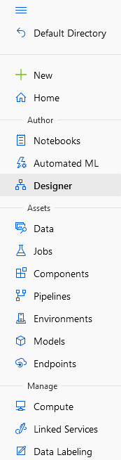
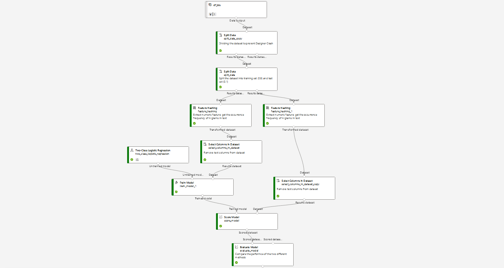
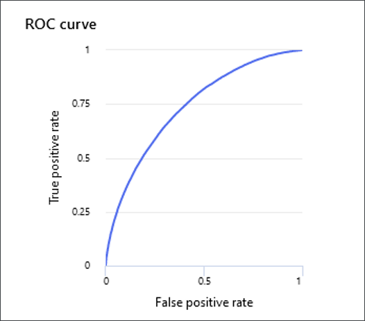
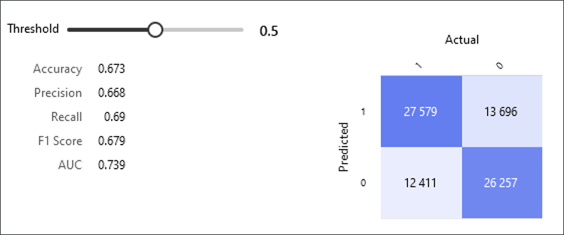
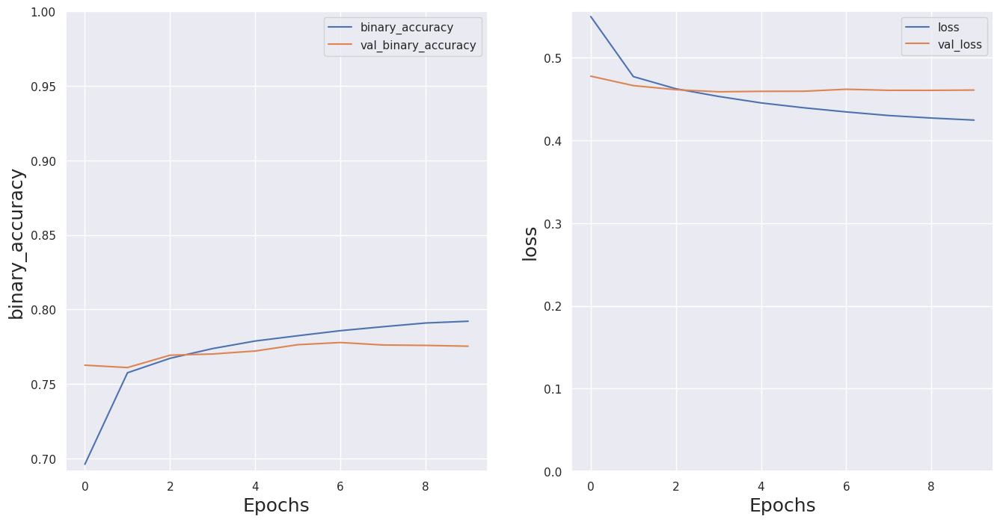

# Building Sentiment Analysis models

Written by: Octave Antoni
Last updated : October 21th, 2022 

# Introduction

Sentiment Analysis can be very important for companies because it can quickly tell them the impact of 
changes they put in place on the opinion of their customers. Social Media platforms such as **Twitter**
are prime candidates for extracting data on the polarity of the public opinion regarding a company.

We used open source labelled Twitter data for this project since our client did not have such data to
provide us.

During this project, our team has identified **3 different methods of analyzing the Sentiments of Twitter
posts**:

- A **Basic Sentiment Analysis using a Logistic Regression Model** with the Azure Machine Learning Designer
platform

- An **API-based approach** using Microsoft Azure Cognitive Services API

- An **Advanced Approach using a BERT model** coupled with a Recurrent Neural Network (RNN)

NB : The code for this project is freely available [on Github](https://github.com/Faskill/Twitter-Sentiment-Analysis)
for readers wanting additional details. We will try to keep the code as short as possible on the blog post to
underline important decisions.


## 1. Basic Sentiment Analysis using Azure ML Designer

Azure Machine Learning Studio provides a built in Designer platform allowing us to build code-free ML models.
On the left panel of Microsoft Azure Machine Learning Studio, select **Desginer** to get started :



What's interesting is that there are sample machine learning flows that you can select from. 

For this project, we **built our own classification flow** :



As you can see in the flow, it was necessary to **split the dataset twice** because our compute instance
was **not able to handle our 1.6million row** dataset. We then performed bigram feature hashing on our
text data before training our Logistic Regression Model.

Here are the results :





The **accuracy for this Basic Sentiment Analysis is quite low at 0.67**, so we wouldn't advise actually
using this in production, although it might be possible to improve the performance of the model by
changing the embedding technique or selecting a more advanced classification model.


## 2. Azure Cognitive Service API Sentiment Analysis

Using the Azure Cognitive Service API is straightforward but it requires an Azure account as well as a 
dedicated Cognitive Service account. 

The use of this service with Python requires to store API credentials in a separate file (called cred.py
in my case). 

A **big limitation of this API** is that the number of documents analyzed per request is **limited to 10**.
What's more, **the free tier only enables 5000 requests per month** and additional requests can be costly.

Here is a code example to retrieve sentiment on a dataset of 500 records :

```python
from azure.core.credentials import AzureKeyCredential
from azure.ai.textanalytics import TextAnalyticsClient
import cred

credential = AzureKeyCredential(cred.cognitive_credential)
endpoint=cred.cognitive_endpoint

text_analytics_client = TextAnalyticsClient(endpoint, credential)

text_analytics_client

results = []
labels=[]

for i in range(1,51,1):
    k = 10*(i-1)
    l = 10*i
    subset = sample_df[k:l]
    
    documents = subset["text"]

    response = text_analytics_client.analyze_sentiment(documents.to_list(), language="en")
    result = [doc for doc in response]

    results.append(result)

    azure_label = [1 if doc.confidence_scores.positive > doc.confidence_scores.negative else 0 for doc in result]

    labels.append(azure_label)

flat_labels = list(np.concatenate(labels).flat)
```

The results of this API are underwhelming for our Twitter data, **it only reaches an accuracy of 0.72**.

These results are not very good for a paid algorithm that still takes time to run because the number of records
that it can analyze is limited to 10/request, which is why I would not currently advise this method.

It is possible though that this API is more optimized for other kinds of data such as reviews.

## 3. Text Classification using Deep Learning

We have chosen to use a Recurrent Neural Network (RNN) for this task after analyzing several Research Papers, and especially the [Comparative Study of CNN and RNN for Natural Language Processing, by Wenpeng Yin, Katharina Kann, Mo Yu and Hinrich Schütze](https://arxiv.org/abs/1702.01923v1)

The summary of their findings are presented below :


As is obvious, for Sentiment Analysis (SentiC), **RNN are more performant than CNNs**.


### 3.1 Choosing the best Text Embedding 

We have tried 2 kinds of embeddings for this project :

- Text Vectorization using the TextVectorization Kera layer (vocabulary size of 10k words)
- BERT Embedding

**Testing has shown that BERT had higher performance than Text Vectorization on our Deep Learning Models**.

### 3.2 Choosing the best Model

We used 3 kind of models with our dataset :

- Convolutional Neural Network (CNN) 
- RNN with Long Short Term Memory (LSTM) layer 
- RNN with Gated Recurrent Unit (GRU) layer

The most performant model is the RNN with the GRU layer using BERT embedding, with an **accuracy of 0.776 on the test set**.

We have used the smallest SBERT model (L-2 H-128) for this implementation because of computing limitations, but
we could probably **further increase the accuracy by using a better performing compute**.

Here is the implementation :

```python
from official.nlp import optimization  # to create AdamW optimizer
import tensorflow_hub as hub

#Using the most modern large BERT encoder since we have long strings
text_input = tf.keras.layers.Input(shape=(), dtype=tf.string)
preprocessor = hub.KerasLayer(
    "https://tfhub.dev/tensorflow/bert_en_uncased_preprocess/3", name="preprocessor")
encoder_inputs = preprocessor(text_input)
encoder = hub.KerasLayer(
    "https://tfhub.dev/tensorflow/small_bert/bert_en_uncased_L-2_H-128_A-2/2",
    trainable=True, name='BERT_encoder')
outputs = encoder(encoder_inputs)
pooled_output = outputs["pooled_output"]      # [batch_size, 1024].
sequence_output = outputs["sequence_output"]  # [batch_size, seq_length, 1024].

def build_classifier_model():
    text_input = tf.keras.layers.Input(shape=(), dtype=tf.string, name='text')
    encoder_inputs = preprocessor(text_input)
    outputs = encoder(encoder_inputs)
    net = outputs['sequence_output']
    net = tf.keras.layers.GRU(200)(net)
    net = tf.keras.layers.Dropout(0.3)(net)
    net = tf.keras.layers.Dense(1, activation=None, name='classifier')(net)
    return tf.keras.Model(text_input, net)

classifier_model = build_classifier_model()

epochs=10

steps_per_epoch = tf.data.experimental.cardinality(train_ds).numpy()
num_train_steps = steps_per_epoch * epochs
num_warmup_steps = int(0.1*num_train_steps)

init_lr = 3e-5
optimizer = optimization.create_optimizer(init_lr=init_lr,
                                          num_train_steps=num_train_steps,
                                          num_warmup_steps=num_warmup_steps,
                                          optimizer_type='adamw')

loss = tf.keras.losses.BinaryCrossentropy(from_logits=True)
metrics = tf.keras.metrics.BinaryAccuracy()

classifier_model.compile(optimizer=optimizer,
                         loss=loss,
                         metrics=metrics)
classifier_model.summary()

import gc

checkpoint_filepath = "tmp_bert_2/cp-{epoch:04d}.ckpt"
model_checkpoint_callback = tf.keras.callbacks.ModelCheckpoint(
    filepath=checkpoint_filepath,
    save_weights_only=True,
    verbose=1)

class MemClearCallback(tf.keras.callbacks.Callback):
    def on_epoch_end(self, epoch, logs=None):
        tf.keras.backend.clear_session() #Resets RAM usage after every EPOCH
        gc.collect()
        
mem_clear = MemClearCallback()

history_bert = classifier_model.fit(x=train_ds,
                                    validation_data=val_ds,
                                    epochs=epochs,
                                    callbacks = [mem_clear, model_checkpoint_callback]
                                   )
```

Below are the results of this model :




## 4. Conclusion

We have shown in this project that there are **different methods to implement Sentiment Analysis** using the 
Azure Machine Learning Studio platform.

The **best method** is the implementation of a **deep learning model using Azure Machine Learning studio**.

After testing several embedding / model combinations, we have concluded that the **BERT Embedding + Recurrent
Neural Network with a Gated Recurrent Unit (RNN / GRU) is the most performant** for Twitter Review sentiment
analysis.

The model **could be further improved by increasing the number of training epochs** and using a higher-end 
computing virtual machine.